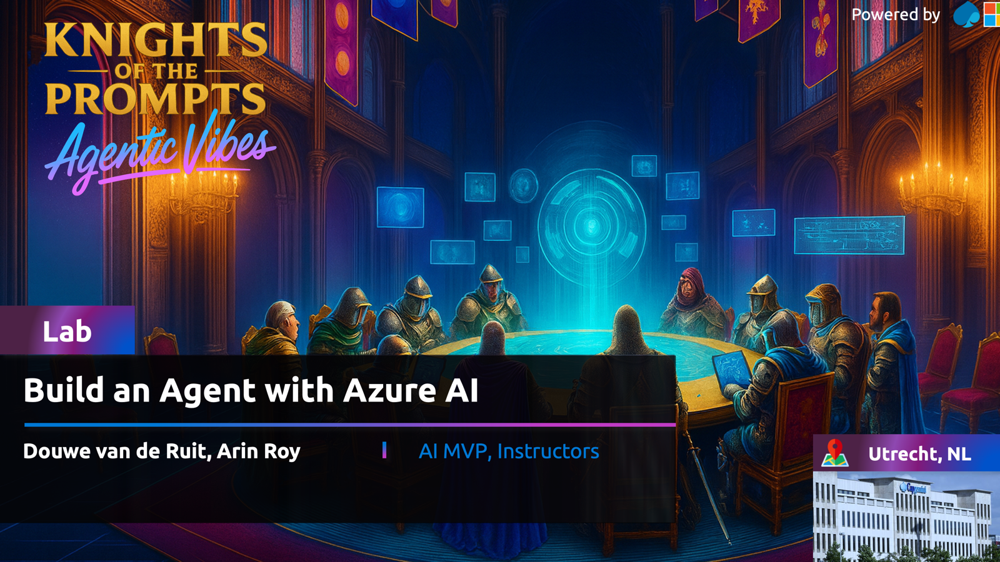

# **Welcome to the "Build Agents with Azure AI Foundry" workshop repo!** 🎉

Dive into the world of intelligent conversational agents with Azure AI Foundry & AI Agent Service, a seamless blend of service and SDK that simplifies the development of robust AI-driven solutions. In this hands-on workshop, you’ll learn to create a powerful agent capable of answering sales-related queries, performing data analysis, generating visualizations, and integrating external data sources to deliver enhanced business insights. 🚀

### ⏱️ Duration
🕒 45 - 60 minutes

## 💡 The Use Case for This Lab

    

Imagine you are a sales manager at Contoso, a multinational retail company that sells outdoor equipment. 🏕️ You need to analyze sales data to find trends, understand customer preferences, and make informed business decisions. To help you, Contoso has developed a conversational agent that can answer questions about your sales data. 💬📈

## 🎯 What You Will Learn

By the end of this workshop, you will:
- 🛠️ Build an agent app using Azure AI Agent Service.
- 🔍 Explore its tools.
- 📜 Effectively use instructions to guide the LLM.

## 📖 Workshop Instructions

👉 Start the full workshop here: [Introduction](docs/docs/introduction.md)

## 📚 Additional Resources

When you finished the workshop, check out additional resources such as the samples in the [samples folder](src/samples) and the [official documentation](https://learn.microsoft.com/azure/ai-services/agents/overview).

### Samples overview
Agent Creation:
- [Create AI Agents using the AI Foundry UI](src/samples/create-agent-using-ui/lab-create-ai-agent-in-ai-foundry-ui.md)
- [Create AI Agents using Jupyter Notebooks](src/samples/create-agent-using-notebook/lab-create-ai-agent-using-notebook.ipynb)
- [Create RAG Agents using Jupyter Notebooks](src/samples/create-rag-agent-using-notebook/lab-create-rag-agent-using-notebook.ipynb)
- [Create Multi-Agent Systems using Jupyter Notebooks](src/samples/create-multi-agent-system-using-notebook/lab-create-multi-agent-system-using-notebook.ipynb)
- [Create Agents with the Bing Grounding Tool](src/samples/create-a-bing-grounding-connection/lab-create-a-bing-grounding-connection.md)

Deep Research Tool:
- [Create Agents with the Deep Research Tool](src/samples/create-deep-research-tool/lab-how-to-use-the-deep-research-tool.md)
- [Debugging sample for the Deep Research Tool](src/samples/create-deep-research-tool/lab-deep-research-tool-debugging-sample.md)

Agent Orchestration:

Sovereign AI using Foundry Local:
- [Setup Foundry Local to go Sovereign](src/samples/create-sovereign-agents-using-foundry-local/lab-get-started-with-foundry-local.md)
- [Use OpenAI SDK with Foundry Local](src/samples/create-sovereign-agents-using-foundry-local/lab-use-openai-sdk-with-foundry-local.md)

Build User Interface:
- [Create a (mockup) User Interface for Agents using Vibe Coding](src/samples/create-a-user-interface-for-agents/lab-vibe-coding-mockup-ui.md)