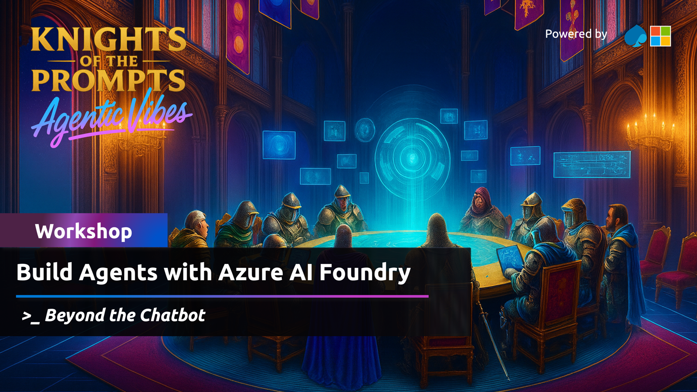

# 🌟 Welcome to this Lab! 
**Welcome to the "Build an Agent with Azure AI" lab repo!** 🎉

Dive into the world of intelligent conversational agents with Azure AI Agent Service, a seamless blend of service and SDK that simplifies the development of robust AI-driven solutions. In this hands-on workshop, you’ll learn to create a powerful agent capable of answering sales-related queries, performing data analysis, generating visualizations, and integrating external data sources to deliver enhanced business insights. 🚀

### ⏱️ Duration
🕒 75 - 90 minutes

## 💡 The Use Case for This Lab

    

Imagine you are a sales manager at Contoso, a multinational retail company that sells outdoor equipment. 🏕️ You need to analyze sales data to find trends, understand customer preferences, and make informed business decisions. To help you, Contoso has developed a conversational agent that can answer questions about your sales data. 💬📈

## 🎯 What You Will Learn

By the end of this workshop, you will:
- 🛠️ Build an agent app using Azure AI Agent Service.
- 🔍 Explore its tools.
- 📜 Effectively use instructions to guide the LLM.

## 📖 Workshop Instructions

👉 Start the full workshop here: [Introduction](docs/docs/getting-started.md)

