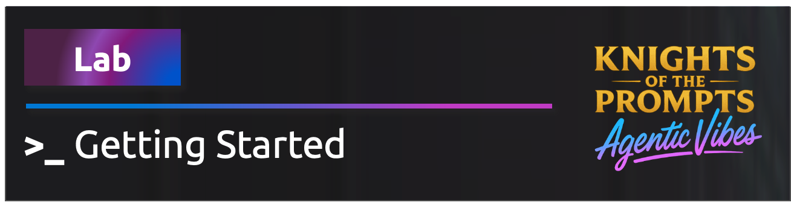
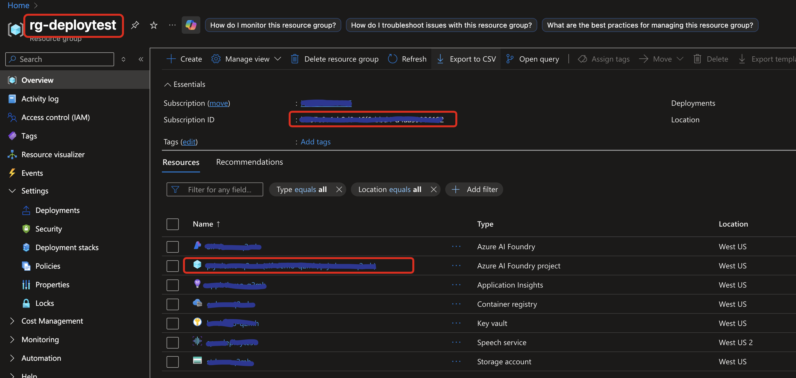
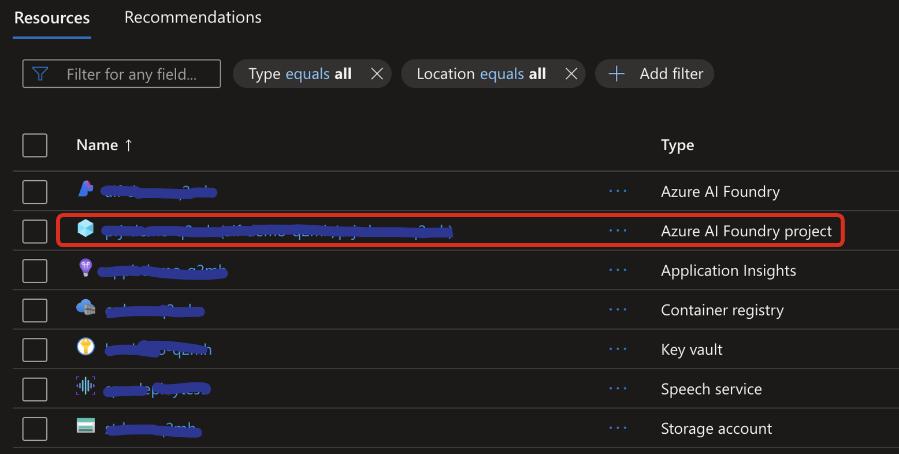
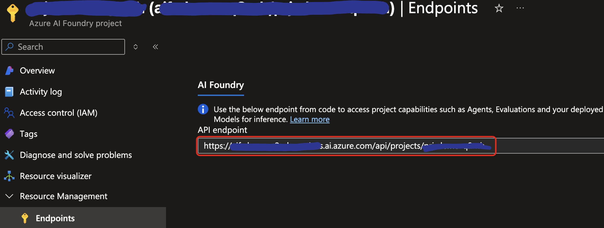

# Getting Started

**Follow these steps to set up your environment and begin the workshop.**

## Prerequisites

### Getting Your Accounts Ready

We'll be using Microsoft tools and services, so there are a couple of quick setup steps.

1. **Microsoft Account Needed:**

    You'll need a Microsoft account for the workshop activities.
    Don't worry about creating a new email! You can absolutely use your existing Gmail, company email, or even your GitHub profile. Just head to [Microsoft Account](https://account.microsoft.com/) and sign in or create an account using your preferred method.

2. **Secure Access with Microsoft Authenticator:**

    To keep things secure (especially when using services like Azure), we'll be using Multi-Factor Authentication (MFA). This is standard practice (BCP) for protecting accounts.  
    The easiest way to handle this is with the Microsoft Authenticator app on your phone.  
    Please install it and link it to your Microsoft account before the workshop starts. It makes verifying your sign-ins quick and secure.  
    You can find it here:  

    - Android users: [Microsoft Authenticator on Google Play Store](https://play.google.com/store/apps/details?id=com.azure.authenticator)  
    - iPhone users: [Microsoft Authenticator on Apple App Store](https://apps.apple.com/app/microsoft-authenticator/id983156458)

3. **You need a GitHub account.** If you do not have one, create it at [GitHub](https://github.com/join).

## Access to an Azure Subscription

For the hackathon you do NOT need to bring your own Azure subscription.  
The instructors have already:
- Provided shared Azure access for each team
- Pre-deployed all required resources (hub, project, and model deployment)

You will receive (or have received) accounts with access to the hackathon environment (i.e. Azure, AI Foundry, etc) from the instructors. 

### Optional: Deploy to Your Own Subscription Later

If you want to explore on your own after the event, you can deploy the resources to your own Azure subscription. You can use the deployment templates in the `infra` folder to set up the necessary Azure resources.


## GitHub Codespaces

The way to run this workshop is using GitHub Codespaces. This provides a pre-configured environment with all the tools and resources needed to complete the workshop.

Select **Open in GitHub Codespaces** to open the project in GitHub Codespaces.

[](https://codespaces.new/doruit/Knights-Of-The-Prompts-Agent-Workshop)

> WARNING "It will take several minutes to build the Codespace so carry on reading the instructions while it builds."

## Lab Structure

Each lab in this workshop includes:

- An **Introduction**: Explains the relevant concepts.
- An **Exercise**: Guides you through the process of implementing the feature.

## Project Structure

The workshop’s source code is located in the **src/workshop** folder. Be sure to familiarize yourself with the key **subfolders** and **files** you’ll be working with throughout the session.

1. The **files folder**: Contains the files created by the agent app.
1. The **instructions folder**: Contains the instructions passed to the LLM.
1. The **main.py**: The entry point for the app, containing its main logic.
1. The **sales_data.py**: Contains the function logic to execute dynamic SQL queries against the SQLite database.
1. The **stream_event_handler.py**: Contains the event handler logic for token streaming.


## Authenticate with Azure

You need to authenticate with Azure so the agent app can access the Azure AI Agents Service and models. Follow these steps:

1. Ensure the Codespace has been created.
1. In the Codespace, open a new terminal window by selecting **Terminal** > **New Terminal** from the **VS Code menu**.
2. Run the following command to authenticate with Azure:

```powershell
az login --use-device-code
```

> NOTE
> You'll be prompted to open a browser link and log in to your Azure account.

> 1. A browser window will open automatically, select your account type and click **Next**.
> 2. Sign in with your Azure subscription **Username** and **Password**.
> 3. Select **OK**, then **Done**.

3. Then select the appropriate subscription from the command line.
4. Leave the terminal window open for the next steps.

## Workshop Configuration
You can get the project connection string from Azure AI Foundry portal. Go to the Azure AI Foundry portal, select your project, and copy the connection string from the **Project Settings** page. 

Your **.env** file should look similar to this but with your project connection string.

```bash
# Azure AI Foundry Project Configuration
AZURE_SUBSCRIPTION_ID=<YOUR AZURE SUBSCRIPTION ID> # the subscription ID of your Azure subscription
AZURE_RESOURCE_GROUP_NAME=<YOUR AZURE RESOURCE GROUP NAME> # the name of the resource group where your Azure AI Foundry resource is located
PROJECT_ENDPOINT=https://<YOUR AZURE AI FOUNDRY RESOURCE NAME>.services.ai.azure.com/api/projects/<YOUR AZURE AI FOUNDRY PROJECT NAME> # the endpoint of your Azure AI Foundry project, you can find it in the Azure portal
AZURE_PROJECT_NAME=<YOUR AZURE AI FOUNDRY PROJECT NAME> # the name of your Azure AI Foundry project
BING_RESOURCE_NAME=<YOUR BING RESOURCE NAME> # don't use the Azure Resource name, use the name that you see in Azure AI Foundry when you create a Bing Grounding resource
AGENT_MODEL_DEPLOYMENT_NAME=gpt-4o # or your custom GPT-4o deployment name
DEEP_RESEARCH_MODEL_DEPLOYMENT_NAME=o3-deep-research # or your custom Deep Research model deployment name
```

## Where to find the values for the .env file
To get the AZURE_SUBSCRIPTION_ID and AZURE_RESOURCE_GROUP_NAME, go to the Azure portal, select your Resource Group, and copy the **Subscription ID** and **Resource Group Name**:


Next, click on the **Azure AI Foundry project resource** and click on Resource Management > Endpoints to get the PROJECT_ENDPOINT:



The AZURE_PROJECT_NAME is the name of your Azure AI Foundry project which you can find in the same UI. It is also part of the PROJECT_ENDPOINT at the end of the URL (i.e. https://your-resource-name.services.ai.azure.com/api/projects/< project name >).

To get the BING_RESOURCE_NAME, go to your Azure AI Foundry project in the Azure portal, click on **Grounding** in the left menu, and copy the name of your Bing Grounding resource:

Now your codespace is ready, let's move to the next step!

## Next 
Proceed to the first lab: [Lab 1: Function Calling](lab-1-function_calling.md)