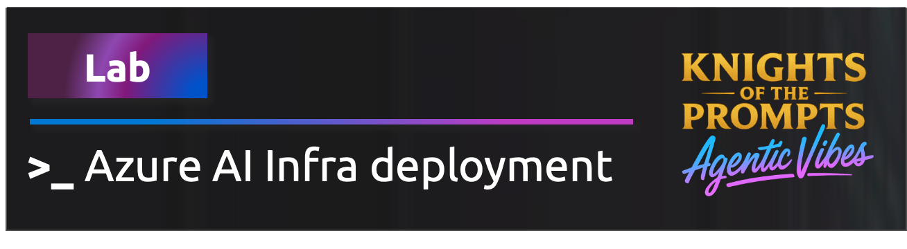

## Azure AI Foundry basic setup

This folder contains all the deployment templates and scripts needed to set up a basic Azure AI Foundry environment with Grounding with Bing Search integration. For the Knights of the Prompts workshop, we will use a simplified configuration of Azure AI Foundry, which is suitable for learning and experimentation purposes.

### What's Deployed

This template deploys the following resources:

- **Azure AI Foundry Hub**: The main AI resource that serves as the workspace
- **Azure AI Project**: A project within the hub for organizing AI assets
- **Azure OpenAI GPT-4o deployment**: Language model deployment for AI agents
- **Grounding with Bing Search**: Real-time web search capabilities for AI agents
- **Supporting resources**: Storage, Key Vault, Container Registry, Application Insights

### Grounding with Bing Search

The template includes a Grounding with Bing Search resource that allows your AI agents to:
- Access real-time web information
- Answer questions requiring current data
- Provide citations and references from web sources
- Follow Microsoft's Use and Display Requirements for Bing content

**Important Notes:**
- Usage of Grounding with Bing Search may incur additional costs
- By deploying this resource, you agree to Microsoft's Bing API terms of use
- Data may be transferred outside Azure compliance boundary as per Bing terms

> **IMPORTANT**  
> Before using this setup, please check with your instructor if environments need to be deployed as part of the workshop. For the Knights of the Prompts hackathon, all the team environments will be deployed by the instructor.

Open your browser and go to the [Azure Portal](https://portal.azure.com). Logon with the credentials provided by your instructor.

[](https://portal.azure.com/#create/Microsoft.Template/uri/https%3A%2F%2Fraw.githubusercontent.com%2Fdoruit%2FKnights-Of-The-Prompts-Agent-Workshop%2Frefs%2Fheads%2Fmain%2Finfra%2Fazuredeploy.json)

### Post-Deployment Steps

After deployment completes successfully:

1. **Register Microsoft.Bing Resource Provider** (if not already registered):
   ```bash
   az provider register --namespace 'Microsoft.Bing'
   ```

2. **Verify Grounding with Bing Search Connection**:
   - Navigate to [Azure AI Foundry portal](https://ai.azure.com)
   - Open your deployed project
   - Go to **Settings** > **Connections**
   - Verify the Bing Grounding Search connection exists
   - If not present, you can create it manually using the deployed resources

3. **Test Agent Integration**:
   - Create a new agent in the AI Foundry portal
   - Add the Grounding with Bing Search tool
   - Test with queries like "What's the latest news about AI?"

### Troubleshooting

- If Bing Grounding Search deployment fails, ensure your subscription has the Microsoft.Bing resource provider registered
- Connection setup may require manual configuration in the AI Foundry portal
- Check Azure Portal for deployment logs and error details

This set of templates demonstrates how to set up Azure AI Foundry with a basic configuration, meaning with public internet access enabled, Microsoft-managed keys for encryption and _Microsoft_-managed identity configuration for the AI hub resource.
