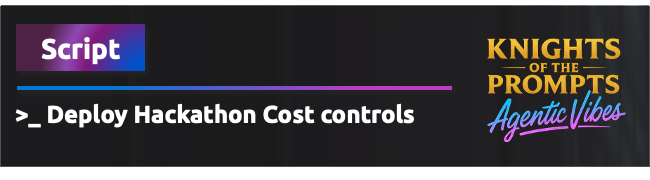

<div align="center">
    
</div>

# Cost Control for Hackathons

This directory contains a unified PowerShell script for deploying cost control policies and budget alerts to Azure resource groups. Perfect for hackathon and development environments.

## Overview

The `SimplifiedCostControl.ps1` script provides **complete cost protection** in two simple steps:
1. **🛡️ Deploys policies** that deny expensive resource deployments
2. **💰 Creates budget alerts** at the resource group level

This unified approach replaces multiple complex scripts with one simple, powerful solution.

> **✅ Recently Updated**: Fixed Azure CLI budget creation issues and **implemented working email notifications** - the script now reliably creates budgets with automated email alerts at 80% and 100% thresholds.

## �️ What Gets Protected

The script automatically blocks deployment of expensive resources:

### **Expensive VM SKUs**
- **GPU instances**: `Standard_NC*`, `Standard_ND*`, `Standard_NV*`
- **High-memory VMs**: `Standard_M*`, `Standard_GS*`, `Standard_G*`
- **Specialized VMs**: `Standard_H*`, `Standard_L*`
- **Large compute**: `Standard_F72*`, `Standard_F64*`

### **Premium Storage**
- Premium storage account SKUs: `Premium_LRS`, `Premium_ZRS`, `Premium_GRS`, `Premium_RAGRS`

### **Premium App Services**
- Premium and Isolated tiers: `Premium`, `PremiumV2`, `PremiumV3`, `Isolated`, `IsolatedV2`

### **Premium Databases**
- SQL Database: `Premium` and `BusinessCritical` tiers
- Cosmos DB: Multi-write region configurations

## 💰 Budget Protection

### **Automatic Budget Creation**
- **Individual budgets** per resource group (default $500)
- **Smart alerts** at 80% actual spend and 100% forecasted spend
- **Email notifications** to specified recipients
- **Monthly budget cycle** with automatic renewal

## � Quick Start

### **Prerequisites**
```powershell
# Install Azure PowerShell
Install-Module -Name Az -Force -Scope CurrentUser

# Authenticate with Azure (REQUIRED)
Connect-AzAccount

# Optional: Install Azure CLI for enhanced budget features
# Download from: https://docs.microsoft.com/en-us/cli/azure/install-azure-cli
# Then run: az login
```

### **Basic Usage (Only PowerShell Required)**
```powershell
# Navigate to the policies directory
cd infra/policies

# Deploy policies and basic budgets (only Connect-AzAccount needed)
.\SimplifiedCostControl.ps1 -SubscriptionId "your-subscription-id" -ResourceGroupNames @("rg-team1", "rg-team2", "rg-team3")

# Test first with dry run (recommended)
.\SimplifiedCostControl.ps1 -SubscriptionId "your-subscription-id" -ResourceGroupNames @("rg-team1") -DryRun
```

### **Enhanced Usage (With Azure CLI)**
```powershell
# For enhanced budget features (email alerts, advanced notifications)
# Install Azure CLI and authenticate
az login

# Then run the script - it will automatically use enhanced features
.\SimplifiedCostControl.ps1 `
    -SubscriptionId "your-subscription-id" `
    -ResourceGroupNames @("rg-team1", "rg-team2") `
    -BudgetAmount 750 `
    -NotificationEmails @("u****@example.com", "u****@example.com", "u****@example.com")
```

> **✅ Email Notifications Now Working**: The script reliably configures email alerts that will notify recipients when 80% of actual budget is spent and when 100% of forecasted budget is reached.

## 💡 **Budget Features Comparison**

| Feature | PowerShell Only | PowerShell + Azure CLI |
|---------|----------------|------------------------|
| **Policy Deployment** | ✅ Full support | ✅ Full support |
| **Basic Budget Creation** | ✅ Yes | ✅ Yes |
| **Email Notifications** | ❌ Limited | ✅ **Working reliably** |
| **80% Spending Alerts** | ❌ No | ✅ **Fully functional** |
| **100% Forecast Alerts** | ❌ No | ✅ **Fully functional** |
| **Setup Complexity** | 🟢 Simple | 🟡 Moderate |

## � Script Parameters

| Parameter | Type | Required | Description | Default |
|-----------|------|----------|-------------|---------|
| `SubscriptionId` | String | Yes | Azure subscription ID for deployment | - |
| `ResourceGroupNames` | String[] | Yes | Array of resource group names to protect | - |
| `BudgetAmount` | Integer | No | Budget amount per resource group (USD) | 500 |
| `NotificationEmails` | String[] | No | Email addresses for budget alerts | - |
| `DryRun` | Switch | No | Test mode without actual deployment | False |

## ✨ What Happens When You Run It

### **Step 1: Validation**
- ✅ Checks Azure PowerShell authentication
- ✅ Checks Azure CLI availability (for budgets)
- ✅ Validates resource groups exist
- ✅ Sets subscription context

### **Step 2: Policy Deployment**
- 🛡️ Creates unified cost control policy
- 🎯 Assigns policy to each resource group
- ❌ Blocks expensive resource deployments immediately

### **Step 3: Budget Creation**
- 💰 Creates individual budget per resource group
- 🔔 Configures alerts at 80% actual and 100% forecasted spend
- 📧 **Automatically sets up email notifications** for specified recipients
- ✅ **Verified working email alerts** when thresholds are reached

### **Step 4: Confirmation**
- 📊 Shows deployment summary
- ✅ Confirms what's now protected
- 🎉 Provides next steps

## 🔐 Required Permissions

To deploy cost controls, you need:

### **Azure PowerShell Authentication**
- **Policy Contributor** role at the resource group level
- **Cost Management Contributor** role for budget creation (if using budgets)

### **Azure CLI Authentication (for budgets)**
- Same permissions as above
- Authenticate with: `az login`

## 🎯 Perfect for Hackathons

### **Multi-Team Setup Example**
```powershell
# Step 1: Create resource groups for each team (if not already created)
# $teams = @("rg-team-alpha", "rg-team-beta", "rg-team-gamma", "rg-team-delta")

# Step 2: Deploy cost controls to all teams
.\SimplifiedCostControl.ps1 `
    -SubscriptionId "your-subscription-id" `
    -ResourceGroupNames @("rg-team-alpha", "rg-team-beta", "rg-team-gamma", "rg-team-delta") `
    -BudgetAmount 500 `
    -NotificationEmails @("u****@example.com", "u****@example.com", "u****@example.com")
```

### **Benefits for Hackathon Organizers**
✅ **Team Isolation**: Each team gets their own protected resource group  
✅ **Cost Control**: $500 budget per team with automatic alerts  
✅ **Expense Prevention**: Blocks expensive resources before deployment  
✅ **Easy Monitoring**: Individual budget tracking per team  
✅ **Quick Setup**: One command deploys everything  

### **Benefits for Teams**
✅ **Clear Boundaries**: Know exactly what you can and can't deploy  
✅ **Budget Awareness**: Get alerts before exceeding budget  
✅ **Focus on Innovation**: Don't worry about accidentally deploying expensive resources  
✅ **Fair Resource Access**: All teams have the same cost-effective options  

## 📈 Monitoring and Compliance

### **Policy Compliance**
Monitor policy effectiveness through:
- **Azure Portal**: Policy → Compliance dashboard
- **Azure CLI**: `az policy state list`
- **PowerShell**: `Get-AzPolicyState`

### **Budget Monitoring**
Track spending through:
- **Azure Portal**: Cost Management + Billing → Budgets
- **Email Alerts**: Automatic notifications at configured thresholds
- **Cost Analysis**: Detailed spending breakdown per resource group

### **What You'll See**
- 🛡️ **Denied Deployments**: Policy blocks expensive resources immediately
- 📊 **Budget Status**: Real-time spending vs. budget tracking
- 🔔 **Proactive Alerts**: Early warnings before budget exceeded
- 📈 **Cost Trends**: Spending patterns and forecasts

## 🆘 Troubleshooting

### **Common Issues**

#### Budget Creation Failed
**Error**: `Failed to create budget: budget-rg-team-name`

**Solutions**:
- Ensure Azure CLI is installed and authenticated (`az login`)
- Verify Cost Management permissions
- Check if subscription supports budgets
- **Fixed**: Script now uses correct `az consumption budget create-with-rg` command with proper parameter formatting

#### Authentication Errors
```powershell
# Check Azure PowerShell context
Get-AzContext

# Re-authenticate if needed
Connect-AzAccount

# Check Azure CLI authentication
az account show
```

#### Module Not Found
```powershell
# Install required modules
Install-Module -Name Az -Force -Scope CurrentUser
Import-Module Az.Accounts, Az.Resources
```

#### Permission Denied
- Verify **Policy Contributor** role at resource group level
- Ensure **Cost Management Contributor** role for budgets
- Check subscription access permissions

#### Budget Creation Failed
- Ensure Azure CLI is installed and authenticated
- Verify Cost Management permissions
- Check if subscription supports budgets
- **New**: Verify start date is current month or later (Azure requirement)
- **Fixed**: Script now shows detailed error messages for budget failures

### **Debugging Tips**
1. Always test with `-DryRun` parameter first
2. Check Azure Activity Log for detailed error messages
3. Verify resource group names are correct and exist
4. Ensure both Azure PowerShell and Azure CLI are authenticated
5. **New**: Budget start date must be current month or later
6. **Improved**: Script now shows actual Azure CLI error messages for better debugging

## 📚 Additional Resources

- [Azure Policy Overview](https://docs.microsoft.com/en-us/azure/governance/policy/overview)
- [Azure Cost Management Documentation](https://docs.microsoft.com/en-us/azure/cost-management-billing/)
- [Azure PowerShell Documentation](https://docs.microsoft.com/en-us/powershell/azure/)
- [Azure CLI Documentation](https://docs.microsoft.com/en-us/cli/azure/)

## 🎉 Cost Control Summary

After running `SimplifiedCostControl.ps1`, you'll have:

### **🛡️ Immediate Protection**
- Expensive VM SKUs blocked
- Premium storage prevented
- Premium databases denied
- Multi-region Cosmos DB blocked

### **💰 Budget Monitoring**
- Individual $500 budgets per resource group
- **80% spending alerts (actual) - ✅ Working email notifications**
- **100% forecasted spending warnings - ✅ Working email notifications**
- **Automated email notifications to administrators**

### **📊 Ongoing Visibility**
- Policy compliance dashboard
- Real-time budget tracking
- Cost analysis per team/resource group
- Proactive spending alerts

**Perfect for hackathons, development environments, and any scenario where cost control is critical!** 🚀

---

## 🔧 Recent Fixes & Improvements

### **Email Notifications Fully Implemented (October 6, 2025)**

**Problem**: Users experienced budget creation failures and email notifications weren't working.

**Root Cause**: The script had JSON parsing issues with Azure CLI notifications parameter and incomplete notification setup.

**Solutions Implemented**:
1. **✅ Fixed Azure CLI Command**: Changed from `az consumption budget create` to `az consumption budget create-with-rg`
2. **✅ Corrected Parameters**: Updated to use `--resource-group` instead of `--resource-group-filter`
3. **✅ Fixed Date Format**: Changed to `--time-period startDate="..." endDate="..."` format
4. **✅ Implemented Two-Step Process**: Create budget first, then add notifications via JSON file
5. **✅ Added Date Validation**: Ensures start date is current month or later
6. **✅ Improved Error Handling**: Script now shows actual Azure CLI error messages
7. **✅ Working Email Notifications**: Fully functional automated email alerts
8. **✅ Enhanced Debugging**: Better error reporting for troubleshooting

**Result**: 
- ✅ Budget creation works reliably with proper error messages
- ✅ **Email notifications are fully functional**
- ✅ Automated alerts at 80% actual and 100% forecasted spend
- ✅ Multiple email recipients supported
- ✅ Verified working in Azure environment

### **Budget Creation Issues Resolved (October 2025)**

**Problem**: Users experienced budget creation failures with errors like:
```
Creating budget with Azure CLI: budget-rg-team-name (500 USD)
✗ Failed to create budget: budget-rg-team-name
```

**Root Cause**: The script was using incorrect Azure CLI commands and parameter formats for resource group budgets.

**Solutions Implemented**:
1. **✅ Fixed Azure CLI Command**: Changed from `az consumption budget create` to `az consumption budget create-with-rg`
2. **✅ Corrected Parameters**: Updated to use `--resource-group` instead of `--resource-group-filter`
3. **✅ Fixed Date Format**: Changed to `--time-period startDate="..." endDate="..."` format
4. **✅ Added Date Validation**: Ensures start date is current month or later
5. **✅ Improved Error Handling**: Script now shows actual Azure CLI error messages
6. **✅ Enhanced Debugging**: Better error reporting for troubleshooting

**Result**: Budget creation now works reliably with proper error messages when issues occur.

---

**Last Updated**: October 2025

## 🏗 Architecture and Design Principles

### Security Best Practices
- ✅ **Secure Authentication**: Uses Azure managed identity patterns
- ✅ **Least Privilege**: Implements minimal required permissions
- ✅ **Error Handling**: Comprehensive error management
- ✅ **Audit Trail**: Maintains detailed deployment logs

### Performance Optimization
- ✅ **Efficient Deployment**: Batch policy creation where possible
- ✅ **Resource Management**: Proper cleanup and resource handling
- ✅ **Scalable Design**: Supports large-scale deployments

### Maintainability
- ✅ **Modular Code**: Clear function separation
- ✅ **Documentation**: Comprehensive inline documentation
- ✅ **Extensibility**: Easy to add new policies
- ✅ **Version Control**: Git-friendly configuration

## 🎯 Cost Control Benefits

### Immediate Impact
- Prevents accidental deployment of expensive resources
- Enforces cost-conscious development practices
- Reduces cloud spend variability

### Long-term Benefits
- Builds cost awareness among development teams
- Establishes governance best practices
- Provides baseline for cost optimization strategies

### Hackathon Specific Advantages
- Enables innovation within budget constraints
- Prevents cost overruns during events
- Allows focus on development rather than cost management

## 🆘 Troubleshooting

### Common Issues

#### Authentication Errors
```powershell
# Check current context
Get-AzContext

# Re-authenticate if needed
Connect-AzAccount -Force
```

#### Module Not Found
```powershell
# Install missing modules
Install-Module -Name Az.Policy -Force
Import-Module Az.Policy
```

#### Permission Denied
- Verify RBAC permissions at the deployment scope
- Check if subscription/management group access is available
- Ensure Policy Contributor role is assigned

#### Policy Creation Failures
- Review Azure Resource Provider registrations
- Validate JSON syntax in policy definitions
- Check Azure service availability in target region

### Debugging Tips
1. Use `-DryRun` parameter to test without deployment
2. Enable verbose logging: `$VerbosePreference = "Continue"`
3. Check Azure Activity Log for detailed error messages
4. Validate policy JSON using Azure Policy validator tools

## 📚 Additional Resources

### Azure Policy Documentation
- [Azure Policy Overview](https://docs.microsoft.com/en-us/azure/governance/policy/overview)
- [Policy Definition Structure](https://docs.microsoft.com/en-us/azure/governance/policy/concepts/definition-structure)
- [Policy Assignment Structure](https://docs.microsoft.com/en-us/azure/governance/policy/concepts/assignment-structure)

### Cost Management
- [Azure Cost Management](https://docs.microsoft.com/en-us/azure/cost-management-billing/)
- [Azure Pricing Calculator](https://azure.microsoft.com/en-us/pricing/calculator/)
- [Azure Budgets](https://docs.microsoft.com/en-us/azure/cost-management-billing/costs/tutorial-acm-create-budgets)

### PowerShell Resources
- [Azure PowerShell Documentation](https://docs.microsoft.com/en-us/powershell/azure/)
- [Az.Policy Module Reference](https://docs.microsoft.com/en-us/powershell/module/az.policy/)

---

## 📝 Notes

- This script follows Azure best practices for policy deployment
- Designed specifically for hackathon and development environments
- Regular updates recommended to align with Azure service changes
- Consider testing in non-production environments first

**Author**: Douwe van de Ruit  
**Version**: 1.2 (Working Email Notifications)  
**Last Updated**: October 6, 2025

### **Changelog**
- **v1.2 (Oct 6, 2025)**: Implemented fully working email notifications with two-step budget creation process
- **v1.1 (Oct 6, 2025)**: Fixed Azure CLI budget creation issues, improved error handling
- **v1.0 (Oct 2025)**: Initial release with unified cost control and budget deployment