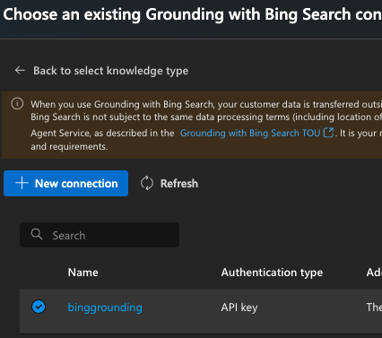

    

## Connect Bing Grounding to your project

Go to Azure Portal, click on your Azure AI Foundry Project resource and open the Azure AI Foundry portal button. In Azure AI Foundry scroll down and click **Open in management center**:

In the management center, click on **Connected resources** in the left menu (on the project level!!!) and then click on **+ New connection**:

At Agent Knowledge Tools select **Grounding with Bing Search**. Look for the Bing Search resource with the name **binggrounding** and select it. Click on **Add connection**:

## Enable Bing Grounding in your .env file
Uncomment the Bing Grounding variable in the .env file. Leave the name to **binggrounding**.

## Test Bing Grounding in the Agent playground
Now you can test the Bing Grounding connection in the playground. Click **Go to project**. Click on **Agents** in the left menu, then click **+ Add** in the Knowledge section, then select the **Bing Grounding** tool with the name **binggrounding** and click on **Next**:

Leave the optional parameters as **default** and click **Connect**. At the top, click on **Try in playground**.

Enter a prompt like "What is the latest news about Microsoft?":

If everything is set up correctly, you should see the agent using the Bing Grounding tool to search the web for the latest news about Microsoft and provide a response based on the search results.