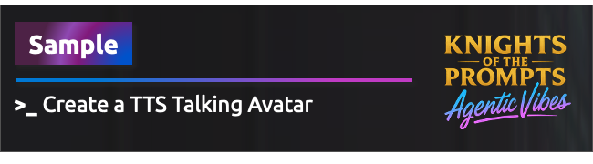
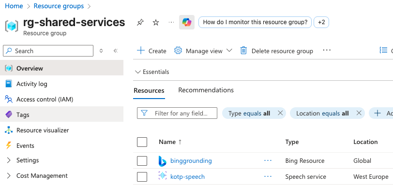
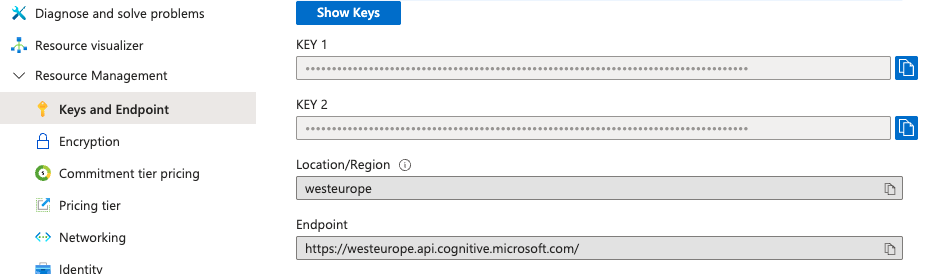
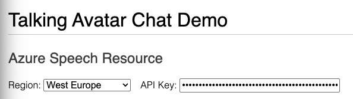
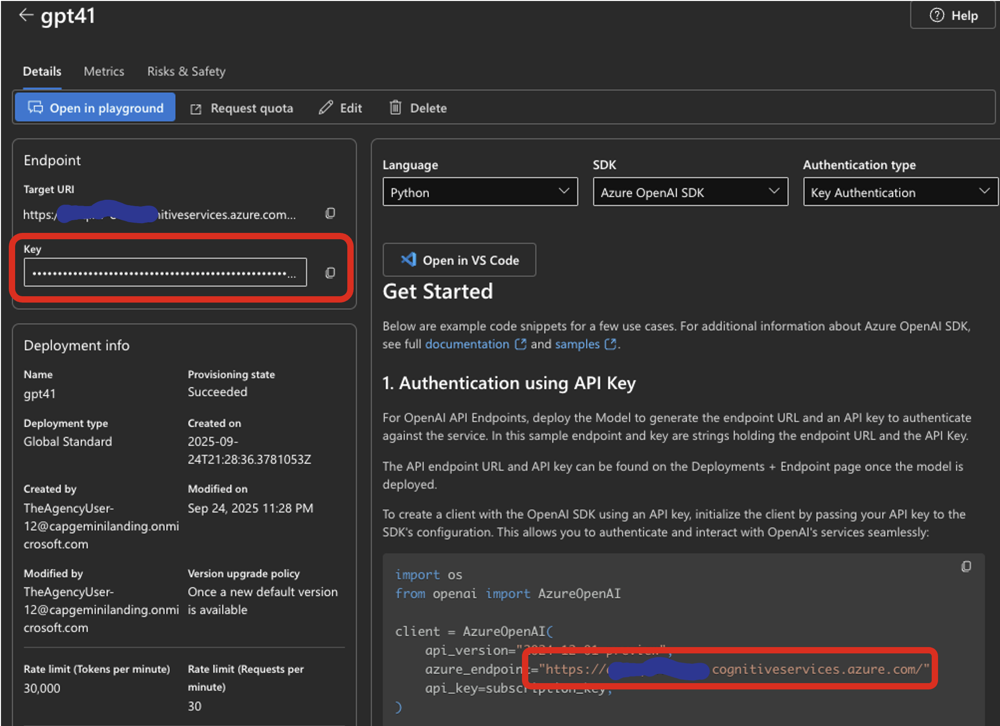
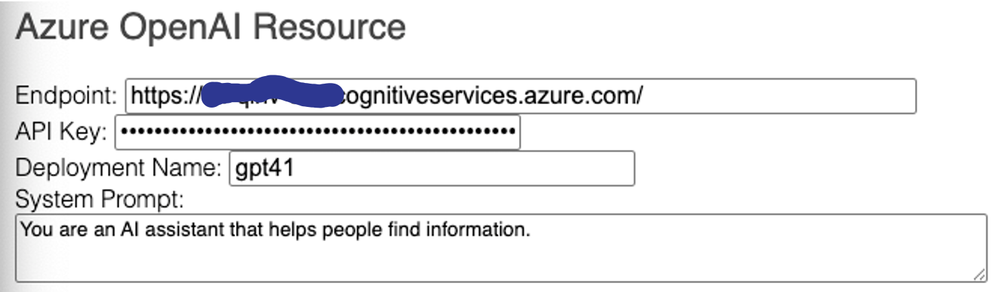
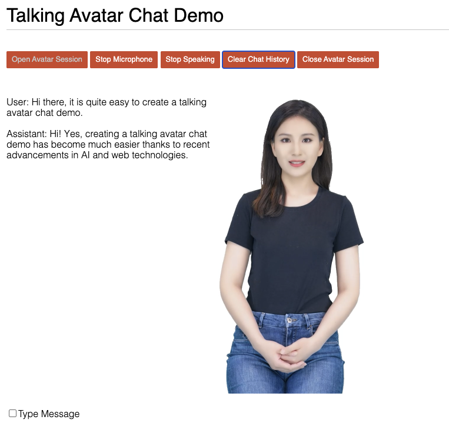

<div align="center">
    
</div>

# Introduction
This folder contains sample code to demonstrate how to create a talking avatar with Azure text-to-speech avatar real-time API. The sample code includes two HTML files: `basic.html` and `chat.html`. With the `basic.html`, you can create a talking avatar that speaks the text you type in a text box. With the `chat.html`, you can create a talking avatar that can chat with you using speech, with integration of Azure speech-to-text, Azure OpenAI, and Azure text-to-speech avatar real-time API. In this example we use a pre-built avatar named `lisa`, but you can also use your own custom avatar. Please refer to [Create a custom avatar](https://learn.microsoft.com/azure/ai-services/speech-service/quickstarts/create-custom-avatar) to learn how to create a custom avatar.

## Prerequisites


## Creating a basic Avatar Chat example

This sample demonstrates the basic usage of Azure text-to-speech avatar real-time API.

* Step 1: Run the sample code by opening chat.html in a browser.
```bash
npx http-server -c-1 -p 8080
```

Then open http://localhost:8080

If you are running in Codespaces a URL will be provided for you. Codespaces automatically sets up a proxy to forward requests from the URL to your running server on port 8080.

And browse to **/samples/create-a-talking-avatar/avatar/chat.html**

Go to the Speech Studio (old portal) to get your subscription key and region. Replace the placeholder values in the code with your actual subscription key and region. 

> TIP: Hackathon participants can go to the Resource Group named "rg-shared-services" to find a Speech resource that you can use for this sample.



On the overview page of the Speech resource, click on "Keys and Endpoint" in the left menu (under Resource Management) to find your subscription key:



Copy the key and paste it in the Talking Avatar Chat Demo page: 



In the Azure OpenAI section we need the endpoint and API key of the Azure OpenAI model that was created in the initial workshop. You can find the endpoint and API key in the **Azure AI Foundry Portal > Models + endpoints > gpt41**: 



>IMPORTANT: Make sure to copy the endpoint without the trailing `/openai/deployments/gpt41` part !!!

So your endpoint should look like this: `https://<your-custom-endpoint>.openai.azure.com/`

Copy/paste both the endpoint and API key in the Talking Avatar Chat Demo page:



Make sure the Deployment Name is set to `gpt41` or at whatever you named the deployment of the Azure OpenAI model.

Now open a new session by clicking on **Open Avatar Session** button. You should see the avatar appear on the page:



That's it! You have successfully created a talking avatar using Azure text-to-speech avatar real-time API. You can type in the text box and click on "Speak" button to hear the avatar speak the text you typed.

## Optional: Vibe code a nice looking UI for your Avatar demo
If you want to create a nice looking UI for your Avatar demo, you can use vibe coding. Simply go to Github Copilot and make sure "Agent Mode" is enabled. Then you can ask Copilot to create a nice looking UI for your Avatar demo. Below is an example prompt that was used in this sample:

```prompt
Create a nice modern looking UI based on the Fluent theme pack of Microsoft.
```

In our case Github Copilot created a seperate workspace and downloaded the Fluent UI theme pack. It then created a nice looking UI for the Avatar demo. Below a screenshot of the result:

<screen shot here>

Do you realize how simple it was to create a nice looking UI for the Avatar demo? You can now use this UI for your own Avatar demos. Enjoy!