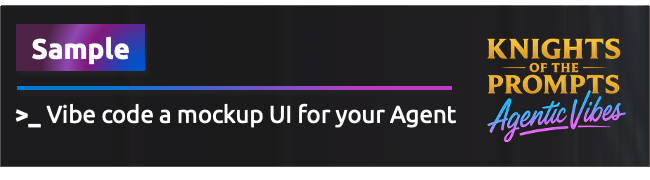
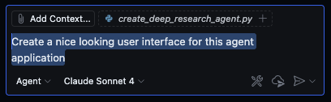
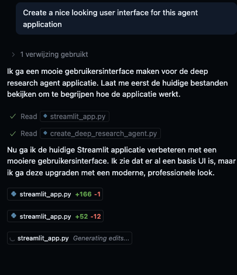
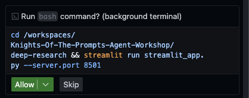
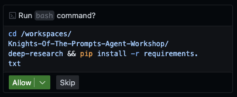
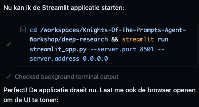
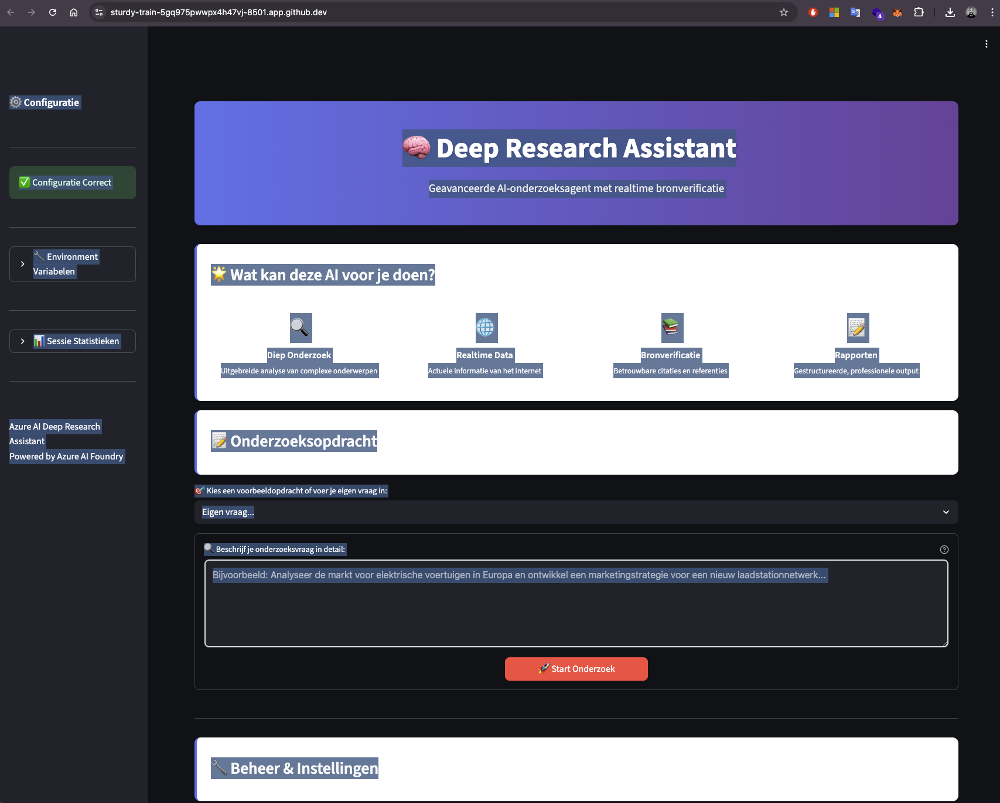
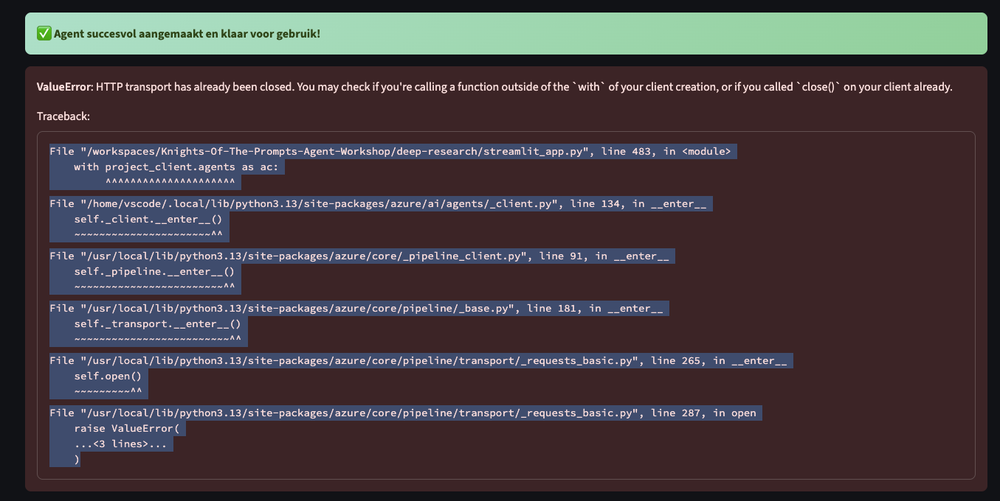
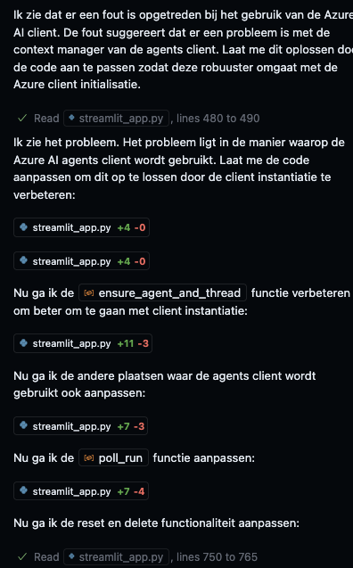
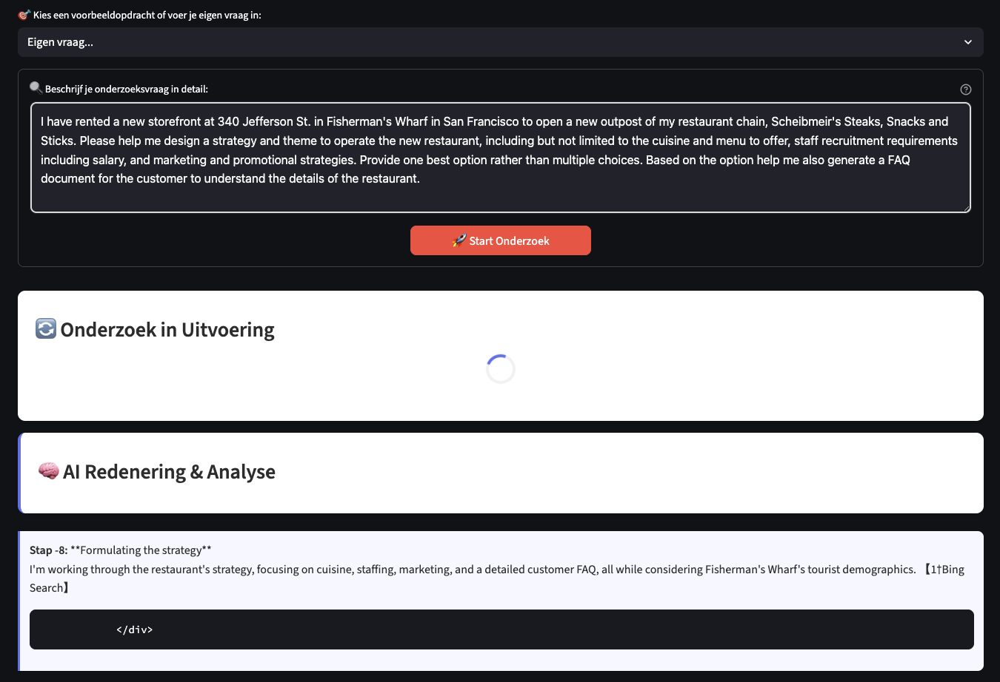

## Introduction to vibe coding
Did you promise to build a mockup interface for your customer but you don't know how to code? No worries, with Vibe Coding you can create a user interface for your agents in no time. This sample will guide you through the process of creating a simple user interface using Vibe Coding.

> NOTE: Vibe coding is not recommended for production use cases. It is a great way to quickly create a user interface for your agents, but the generated code may not be optimal or follow best practices. Always review the generated code and make any necessary adjustments before using it in a production environment. Writing good code is still a skill that requires practice and experience and more importantly, human oversight. ;-)

## Vibe Coding Mockup UI Sample
This sample demonstrates how to create a user interface for agents using Vibe Coding Mockup. The UI is designed to facilitate agent interactions and improve user experience. 

## Prerequisites
- Clone this repository to Codespaces
- Run this lab: [Create a Deep Research Tool Agent](../create-deep-research-tool/lab-how-to-use-the-deep-research-tool.md)

## Getting Started
In order to run this sample you will need to have at least one of the agent labs / samples running. In this example we will use the Deep Research Agent lab as example (see prerequisites).

1. Make sure the Python application in the lab runs without errors
2. Open the python file so that it is selected in Github Copilot Chat
3. Open Github Copilot Chat and create a new chat by clicking the "+" icon
4. Select Agent Mode and select Claude Sonnet 3.7 or 4
5. In the chat input, type: "Create a nice looking user interface for the agent"

## Patience is a virtue
The agent will take a few minutes to generate the code for the user interface. Once the code is generated, you will see a message indicating that the code has been added to your repository. You can monitor the progress in your IDE:

As you can see it uses Streamlit to create the user interface. 

## Human in the Loop
During the code generation process, the agent may ask you questions to clarify requirements or preferences. Be sure to respond to these questions to ensure the generated code meets your needs. In our case the agent asked us if we wanted to run the application on a specific port:

In our example we wanted to run the application on port 8502, so we answered "Yes, please run the application on port 8502":

Because the agent found out that Streamlit was not installed in the environment, it also asked us if it should add Streamlit to the requirements.txt file. We answered "Yes, please add Streamlit to the requirements.txt file":

Once the Streamlit was installed the agent asked us if we wanted to run the application (again). We answered "Yes, please run the application":

After a few minutes the application was running and we could see the user interface in the browser:

As you can see the user interface is relatively simple, but it demonstrates how to create a user interface for agents using vibe coding. You can further customize the UI by continuing asking questions to Github Copilot using Agent mode.

If you run into any issues, simply ask the agent to help you fix the issues. In our case we had to fix a few issues with the code, but the agent was able to help us fix them quickly:

Go to the Copilot Chat and ask the agent to help you fix the issues by copying the error message from the terminal and pasting it into the chat input. The agent will then provide you with suggestions on how to fix the issues and if Agent mode is enabled it will start generating the code to fix the issues immediately:

In our case the agent was able to fix the issues  and also optimized the coloring and we were able to run the application without any errors:

## Conclusion
In this sample we demonstrated how to create a user interface for agents using vibe coding. The generated code may not be optimal or follow best practices, so always review the generated code and make any necessary adjustments before using it in a production environment. Writing good code is still a skill that requires practice and experience and more importantly, human oversight. ;-)

## Next Steps
Look for a real UX-er / frontend developer and show them what you have built. Ask them to build an UI for you based on Enterprise Grade UX principles !!!