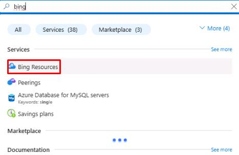
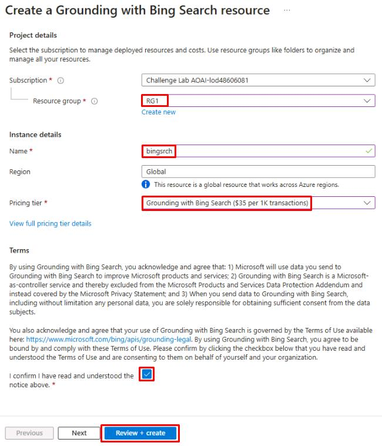
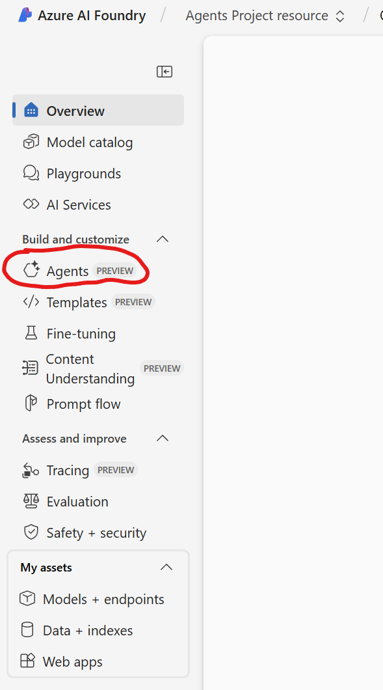
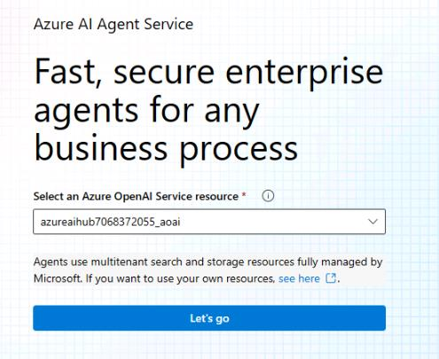
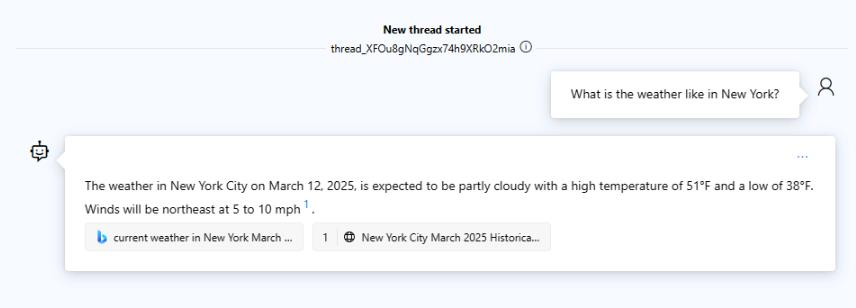
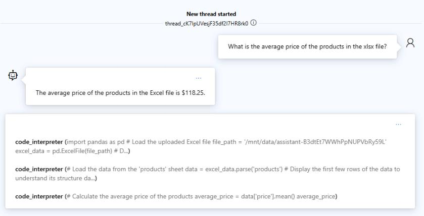

    

# Sample: Create AI Agent in AI Foundry UI

## Description
In this Lab, you’ll learn how to create a simple Agent in AI Foundry that can retrieve answers from an excel file and also query Bing Search for latest weather.

## Key Tasks

### Set up Grounding with Bing Search in Azure Portal
1. Log into Azure portal, In the search bar at the top, search for **bing** and then select **Bing Resources**.

2. From the **Bing Resources** page, select **+ Add**, then select **+ Grounding with Bing Search**.

3. On the **Create a Grounding with Bing Search resource** page, select your resource group and pricing tier. Give it a name of **bingsrch** and select **Review + Create**, then select **Create**.

### Setup your Agent in AI Foundry

4. Switch to AI Foundry and select **Agents** from the left menu.

5. If this popup is shown: Under **Select an Azure OpenAI Service resource**, select your hub and select **Let’s go**. If you have already done this step earlier, you won’t see this popup anymore.

6. Under **Select or deploy a model**, select the model that was pre-deployed (for Knights of the Prompts this is **gpt-4.1**), then select **Next**.

7. Select the agent and open the **Setup** pane.  
8. In the **Instructions** field of the **Setup** pane, copy and paste the following:

> Understand User Query:
> Analyze the user's query to identify if it requires real-time information (e.g., weather, date, news).
> 
> Use Bing Search Tool for Real-Time Data:
> If the query involves up-to-date information, use the Bing Search tool to retrieve relevant data.
> 
> Craft a Clear, Concise Response:
> Extract the relevant information (e.g., temperature, news) and provide the answer in a simple and direct way.
> 
> Ask for Clarification if Needed:
> If the query is vague or missing details (e.g., location for weather), ask the user for more information.

### Configure the Agent with Grounding data and Tool Calling

9. Under **Knowledge** in the **Setup** pane, select **+ Add**, then select **Grounding with Bing Search**.  
10. Select **+ Create connection**, then select **Add connection** next to the **bingsrch** resource.

11. Under **Actions** in the **Setup** pane, select **+ Add**, then select **Code interpreter**.  
12. On the **Add code interpreter action** page, select **Select local files** and then select the **products.xlsx** file created earlier.  
13. Select **Upload and Save**.

14. From the upper right of the **Setup** pane, select **Try in playground**.  
15. In the **Agents playground** chat, enter: What is the weather like in New York?

16. Then enter: What is the average price of the products in the xlsx file?

