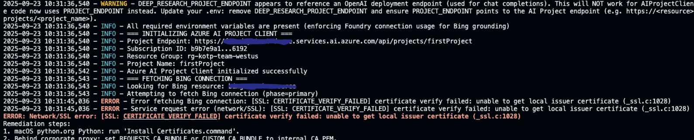
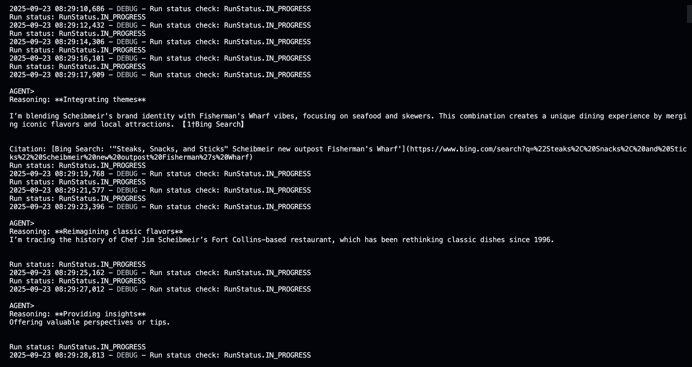

## Debugging the Deep Research Tool
In this sample we will show you how to debug issues when using the Deep Research Tool in your AI Agent. By adding some print statements to your code you can get insights into what is happening when the agent is using the Deep Research Tool. 

A fun fact is that we had to debug the Deep Research Tool when we were creating the Deep Research Tool sample, so we know from experience that this can be very useful! In fact, using this debugging code, we found out that the Deep Research Tool was not working because our Zscaler network was blocking the Bing Grounding service. So, if you are using a corporate network, make sure that the Bing Grounding service is not blocked!

## Setup the .env file
Make sure you have a `.env` file in the same directory as your script with the following content:
```
# Azure AI Foundry Project Configuration
AZURE_SUBSCRIPTION_ID=<YOUR AZURE SUBSCRIPTION ID>
AZURE_RESOURCE_GROUP_NAME=<YOUR AZURE RESOURCE GROUP NAME>
AGENT_MODEL_DEPLOYMENT_NAME=gpt-4o # or your custom GPT-4o deployment name
DEEP_RESEARCH_MODEL_DEPLOYMENT_NAME=o3-deep-research # or your custom Deep Research model deployment name
BING_RESOURCE_NAME=<YOUR BING RESOURCE NAME>
AZURE_PROJECT_NAME=<YOUR AZURE AI FOUNDRY PROJECT NAME>
PROJECT_ENDPOINT=https://<YOUR AZURE AI FOUNDRY RESOURCE NAME>.services.ai.azure.com/api/projects/<YOUR AZURE AI FOUNDRY PROJECT NAME>
```
## Create a virtual environment
Create a virtual environment to manage your Python dependencies. Run the following commands in your terminal:
```bash
python -m venv venv
source venv/bin/activate  # On Windows use `venv\Scripts\activate`
```
Open a new terminal in VS Code and make sure the virtual environment is activated.

## Logon to Azure
Make sure you are logged in to Azure CLI with the correct account that has sufficient permissions to your Azure resources:
```bash
az login --use-device-code
```
Make sure to choose the correct subscription if you have multiple subscriptions. 

## Install Python packages 
Create requirements.txt file with the following content:
```
azure-ai-projects>=1.0.0b12
azure-ai-agents>=1.1.0b4
colorama>=0.4.6
azure-identity>=1.17.0
python-dotenv>=1.0.1
``` 
Then run the following commands to install the required packages:
```bash
pip install -r requirements.txt
```

## Create the script
Create a new Python file named `deep_research_tool_debugging_sample.py` and add the following code:
```python
import os
import time
import re
import logging
import socket
import ssl
from datetime import datetime
from typing import Optional
from dotenv import load_dotenv
from azure.ai.projects import AIProjectClient
from azure.identity import DefaultAzureCredential
from azure.ai.agents import AgentsClient
from azure.ai.agents.models import DeepResearchTool, MessageRole, ThreadMessage
from azure.core.exceptions import ResourceNotFoundError, ClientAuthenticationError, ServiceRequestError
from colorama import init, Fore, Back, Style

# Initialize colorama for cross-platform colored output
init(autoreset=True)

# Color constants
class Colors:
    ERROR = Fore.RED + Style.BRIGHT
    WARNING = Fore.YELLOW + Style.BRIGHT
    SUCCESS = Fore.GREEN + Style.BRIGHT
    INFO = Fore.CYAN + Style.BRIGHT
    RESET = Style.RESET_ALL

# Custom colored formatter for logging
class ColoredFormatter(logging.Formatter):
    """Custom formatter to add colors to log levels"""
    
    COLORS = {
        'DEBUG': Fore.WHITE,
        'INFO': Fore.CYAN,
        'WARNING': Fore.YELLOW + Style.BRIGHT,
        'ERROR': Fore.RED + Style.BRIGHT,
        'CRITICAL': Fore.RED + Back.WHITE + Style.BRIGHT,
    }

    def format(self, record):
        log_color = self.COLORS.get(record.levelname, '')
        record.levelname = f"{log_color}{record.levelname}{Style.RESET_ALL}"
        return super().format(record)

# Configure logging with colors
handler = logging.StreamHandler()
handler.setFormatter(ColoredFormatter('%(asctime)s - %(levelname)s - %(message)s'))
logger = logging.getLogger(__name__)
logger.setLevel(logging.DEBUG)
logger.addHandler(handler)
# Prevent duplicate logs
logger.propagate = False

# Load environment variables from .env file if they're not already set
load_dotenv()

# New: helper to detect wrong endpoint usage
def _is_openai_deployment_endpoint(url: str) -> bool:
    return ".openai.azure.com/openai/deployments" in url if url else False

# ==================================================================================
# Debug / Diagnostics Utilities
# ==================================================================================

TRUE_SET = {"1", "true", "yes", "on"}
DEBUG_ENABLED = os.getenv("DEBUG", "false").lower() in TRUE_SET
HTTP_DEBUG = os.getenv("AZURE_HTTP_DEBUG", "false").lower() in TRUE_SET

def _redact(value: Optional[str]) -> str:
    if value is None:
        return "<unset>"
    if len(value) <= 8:
        return "***"
    return value[:4] + "…" + value[-4:]

def dump_environment():
    if not DEBUG_ENABLED:
        return
    logger.debug("=== DEBUG: ENVIRONMENT SNAPSHOT (redacted) ===")
    keys = [
        "PROJECT_ENDPOINT",
        "AZURE_SUBSCRIPTION_ID",
        "AZURE_RESOURCE_GROUP_NAME",
        "AZURE_PROJECT_NAME",
        "BING_RESOURCE_NAME",
        "DEEP_RESEARCH_MODEL_DEPLOYMENT_NAME",
        "AGENT_MODEL_DEPLOYMENT_NAME",
        "CUSTOM_CA_BUNDLE",
        "REQUESTS_CA_BUNDLE",
        "SSL_CERT_FILE",
        "ALLOW_INSECURE_SSL",
        "DEBUG",
        "AZURE_HTTP_DEBUG",
        "AZURE_LOG_LEVEL",
    ]
    for k in keys:
        logger.debug(f"  {k}={_redact(os.getenv(k))}")

def enable_azure_http_logging():
    if HTTP_DEBUG:
        http_logger = logging.getLogger("azure.core.pipeline.policies.http_logging_policy")
        http_logger.setLevel(logging.DEBUG)
        http_logger.addHandler(logging.StreamHandler())
        logger.info("Enabled Azure HTTP request/response logging (headers redacted by SDK).")

def ssl_diagnostics(host: str = "login.microsoftonline.com", port: int = 443):
    """Attempt a raw TLS handshake to surface certificate / trust issues early."""
    if not DEBUG_ENABLED:
        return
    logger.debug(f"=== DEBUG: Performing SSL diagnostics to {host}:{port} ===")
    try:
        ctx = ssl.create_default_context()
        bundle = os.getenv("CUSTOM_CA_BUNDLE") or os.getenv("REQUESTS_CA_BUNDLE") or os.getenv("SSL_CERT_FILE")
        if bundle:
            if os.path.exists(bundle):
                ctx.load_verify_locations(cafile=bundle)
                logger.debug(f"Loaded custom CA bundle: {bundle}")
            else:
                logger.debug(f"Declared CA bundle path not found: {bundle}")
        with socket.create_connection((host, port), timeout=5) as sock:
            with ctx.wrap_socket(sock, server_hostname=host) as ssock:
                cert = ssock.getpeercert()
                logger.debug(f"TLS negotiated protocol: {ssock.version()}")
                logger.debug(f"Server certificate subject: {cert.get('subject')}")
                logger.debug(f"Server certificate issuer: {cert.get('issuer')}")
    except Exception as e:
        logger.debug(f"SSL diagnostic failed: {e}")

def enumerate_connections(project_client: AIProjectClient):
    if not DEBUG_ENABLED:
        return
    logger.debug("=== DEBUG: Enumerating available connections ===")
    try:
        names = []
        for c in project_client.connections.list():
            logger.debug(f"Connection name={c.name} id={c.id} type={getattr(c, 'connection_type', 'unknown')}")
            names.append(c.name)
        if not names:
            logger.debug("No connections returned by service.")
    except Exception as e:
        logger.debug(f"Failed to list connections: {e}")

def log_run_steps(agents_client: AgentsClient, thread_id: str, run_id: str):
    if not DEBUG_ENABLED:
        return
    logger.debug("=== DEBUG: Attempting to enumerate run steps ===")
    try:
        # Not all SDK versions expose list_steps; guard dynamically.
        if hasattr(agents_client.runs, "list_steps"):
            for step in agents_client.runs.list_steps(thread_id=thread_id, run_id=run_id):
                logger.debug(f"Run step: id={getattr(step,'id',None)} type={getattr(step,'type',None)} status={getattr(step,'status',None)}")
        else:
            logger.debug("agents_client.runs.list_steps not available in this SDK version.")
    except Exception as e:
        logger.debug(f"Could not fetch run steps: {e}")

dump_environment()
enable_azure_http_logging()
ssl_diagnostics()

def print_error(message):
    """Print error messages in red"""
    print(f"{Colors.ERROR}ERROR: {message}{Colors.RESET}")

def print_warning(message):
    """Print warning messages in yellow"""
    print(f"{Colors.WARNING}WARNING: {message}{Colors.RESET}")

def print_success(message):
    """Print success messages in green"""
    print(f"{Colors.SUCCESS}SUCCESS: {message}{Colors.RESET}")

def print_info(message):
    """Print info messages in cyan"""
    print(f"{Colors.INFO}INFO: {message}{Colors.RESET}")

def validate_environment_variables():
    """Validate that all required environment variables are set and log their values (safely).
    Updated to enforce use of Azure AI Foundry (Projects) connection for Bing grounding only.
    Direct Bing endpoint/url variables are intentionally ignored to ensure the SDK connection
    (connection id) is the sole integration path per current guidance.
    """
    required_vars = [
        # Replaced DEEP_RESEARCH_PROJECT_ENDPOINT with PROJECT_ENDPOINT (full AI Project endpoint)
        "PROJECT_ENDPOINT",
        "AZURE_SUBSCRIPTION_ID",
        "AZURE_RESOURCE_GROUP_NAME",
        "AZURE_PROJECT_NAME",
        "BING_RESOURCE_NAME",  # We rely exclusively on the Foundry connection name
        "DEEP_RESEARCH_MODEL_DEPLOYMENT_NAME",
        "AGENT_MODEL_DEPLOYMENT_NAME"
    ]

    logger.info("=== ENVIRONMENT VARIABLE VALIDATION ===")
    missing_vars = []

    for var in required_vars:
        value = os.environ.get(var)
        if not value:
            missing_vars.append(var)
            logger.error(f"Missing required environment variable: {var}")
        else:
            if "endpoint" in var.lower() or "url" in var.lower():
                logger.info(f"{var}: {value[:80]}..." if len(value) > 80 else f"{var}: {value}")
            elif "subscription" in var.lower() or var.lower().endswith("_id"):
                logger.info(f"{var}: {value[:8]}...{value[-4:]}")
            else:
                logger.info(f"{var}: {value}")

    # Backward compatibility / warning for deprecated variable
    deprecated_endpoint = os.environ.get("DEEP_RESEARCH_PROJECT_ENDPOINT")
    if deprecated_endpoint:
        if _is_openai_deployment_endpoint(deprecated_endpoint):
            logger.warning(
                "DEEP_RESEARCH_PROJECT_ENDPOINT appears to reference an OpenAI deployment endpoint (used for chat completions). "
                "This will NOT work for AIProjectClient (connections, agents). The code now uses PROJECT_ENDPOINT instead. "
                "Update your .env: remove DEEP_RESEARCH_PROJECT_ENDPOINT and ensure PROJECT_ENDPOINT points to the AI Project endpoint (e.g. https://<resource>.services.ai.azure.com/api/projects/<project_name>)."
            )
        else:
            logger.warning(
                "DEEP_RESEARCH_PROJECT_ENDPOINT is deprecated. The code now exclusively uses PROJECT_ENDPOINT. Remove the old variable to silence this warning."
            )

    if missing_vars:
        logger.error(f"Missing environment variables: {missing_vars}")
        raise ValueError(f"Missing required environment variables: {missing_vars}")

    # Validate PROJECT_ENDPOINT shape
    project_ep = os.environ.get("PROJECT_ENDPOINT", "")
    if ".openai.azure.com" in project_ep:
        logger.error(
            "PROJECT_ENDPOINT is pointing to an OpenAI inference endpoint. It must be the Azure AI Project endpoint (services.ai.azure.com)."
        )
        raise ValueError("Invalid PROJECT_ENDPOINT. Provide the Azure AI Project endpoint, not an OpenAI deployment endpoint.")
    if "/openai/deployments" in project_ep:
        logger.error("PROJECT_ENDPOINT includes an OpenAI deployments path. Provide the project endpoint instead.")
        raise ValueError("PROJECT_ENDPOINT must be an Azure AI Project base or project URL (contains /api/projects/<name>).")
    if "/api/projects/" not in project_ep:
        logger.warning(
            "PROJECT_ENDPOINT does not contain /api/projects/. If you provided only the service base (e.g. https://<resource>.services.ai.azure.com), this is acceptable, but the SDK must also receive subscription_id/resource_group_name/project_name which are set."
        )

    logger.info("All required environment variables are present (enforcing Foundry connection usage for Bing grounding)")
    return True


def convert_citations_to_superscript(markdown_content):
    """
    Convert citation markers in markdown content to HTML superscript format.
    
    This function finds citation patterns like 【78:12†source】 and converts them to 
    HTML superscript tags <sup>12</sup> for better formatting in markdown documents.
    
    Args:
        markdown_content (str): The markdown content containing citation markers
        
    Returns:
        str: The markdown content with citations converted to HTML superscript format"
    """
    # Pattern to match 【number:number†source】
    pattern = r'【\d+:(\d+)†source】'
    
    # Replace with <sup>captured_number</sup>
    def replacement(match):
        citation_number = match.group(1)
        return f'<sup>{citation_number}</sup>'
    
    return re.sub(pattern, replacement, markdown_content)


def fetch_and_print_new_agent_response(
    thread_id: str,
    agents_client: AgentsClient,
    last_message_id: Optional[str] = None,
) -> Optional[str]:
    """
    Fetch the interim agent responses and citations from a thread and print them to the terminal.
    
    Args:
        thread_id (str): The ID of the thread to fetch messages from
        agents_client (AgentsClient): The Azure AI agents client instance
        last_message_id (Optional[str], optional): ID of the last processed message 
            to avoid duplicates. Defaults to None.
            
    Returns:
        Optional[str]: The ID of the latest message if new content was found, 
            otherwise returns the last_message_id
    """
    response = agents_client.messages.get_last_message_by_role(
        thread_id=thread_id,
        role=MessageRole.AGENT,
    )
    if not response or response.id == last_message_id:
        return last_message_id  # No new content

    # if not a "cot_summary" return
    if not any(t.text.value.startswith("cot_summary:") for t in response.text_messages):
        return last_message_id    

    print("\nAGENT>")
    print("\n".join(t.text.value.replace("cot_summary:", "Reasoning:") for t in response.text_messages))
    print()

    for ann in response.url_citation_annotations:
        print(f"Citation: [{ann.url_citation.title}]({ann.url_citation.url})")

    return response.id


def create_research_summary(
        message : ThreadMessage,
) -> None:
    """
    Create a formatted research report from an agent's thread message with numbered citations 
    and a references section, printed to the terminal.
    
    Args:
        message (ThreadMessage): The thread message containing the agent's research response
            
    Returns:
        None: This function doesn't return a value, it prints to the terminal
    """
    if not message:
        print("No message content provided, cannot create research report.")
        return

    print("\n" + "="*80)
    print("FINAL RESEARCH REPORT")
    print("="*80)

    # Print text summary
    text_summary = "\n\n".join([t.text.value.strip() for t in message.text_messages])
    # Convert citations to superscript format
    text_summary = convert_citations_to_superscript(text_summary)
    print(text_summary)

    # Print unique URL citations with numbered bullets, if present
    if message.url_citation_annotations:
        print("\n\n## Citations")
        seen_urls = set()
        citation_dict = {}
        
        for ann in message.url_citation_annotations:
            url = ann.url_citation.url
            title = ann.url_citation.title or url
            
            if url not in seen_urls:
                # Extract citation number from annotation text like "【58:1†...】"
                citation_number = None
                if ann.text and ":" in ann.text:
                    match = re.search(r'【\d+:(\d+)', ann.text)
                    if match:
                        citation_number = int(match.group(1))
                
                if citation_number is not None:
                    citation_dict[citation_number] = f"[{title}]({url})"
                else:
                    # Fallback for citations without proper format
                    citation_dict[len(citation_dict) + 1] = f"[{title}]({url})"
                
                seen_urls.add(url)
        
        # Print citations in numbered order
        for num in sorted(citation_dict.keys()):
            print(f"{num}. {citation_dict[num]}")

    print("="*80)
    print("Research report completed.")
    print("="*80)


if __name__ == "__main__":
    try:
        # Validate environment variables first
        validate_environment_variables()
        
        project_endpoint = os.environ["PROJECT_ENDPOINT"]
        logger.info("=== INITIALIZING AZURE AI PROJECT CLIENT ===")
        logger.info(f"Project Endpoint: {project_endpoint}")
        logger.info(f"Subscription ID: {os.environ['AZURE_SUBSCRIPTION_ID'][:8]}...{os.environ['AZURE_SUBSCRIPTION_ID'][-4:]}")
        logger.info(f"Resource Group: {os.environ['AZURE_RESOURCE_GROUP_NAME']}")
        logger.info(f"Project Name: {os.environ['AZURE_PROJECT_NAME']}")

        # SSL / certificate configuration
        ssl_kwargs = {}
        custom_ca = os.getenv("CUSTOM_CA_BUNDLE") or os.getenv("REQUESTS_CA_BUNDLE") or os.getenv("SSL_CERT_FILE")
        if custom_ca:
            if not os.path.exists(custom_ca):
                logger.error(f"Specified custom CA bundle path does not exist: {custom_ca}")
                raise ValueError(f"Custom CA bundle not found at {custom_ca}")
            logger.info(f"Using custom CA bundle for TLS verification: {custom_ca}")
            ssl_kwargs["connection_verify"] = custom_ca
        elif os.getenv("ALLOW_INSECURE_SSL", "false").lower() == "true":
            logger.warning("ALLOW_INSECURE_SSL=true - TLS certificate verification is DISABLED. Do NOT use this in production.")
            ssl_kwargs["connection_verify"] = False
        else:
            # Default: rely on system / certifi trust store
            pass
        
        # Support both full project endpoint (contains /api/projects/<project>) and base service endpoint
        if "/api/projects/" in project_endpoint:
            # Full project-scoped endpoint; subscription/resource group/project name not required for client construction
            project_client = AIProjectClient(
                endpoint=project_endpoint,
                credential=DefaultAzureCredential(),
                **ssl_kwargs,
            )
        else:
            # Base endpoint - need subscription, resource group & project name
            project_client = AIProjectClient(
                endpoint=project_endpoint,
                subscription_id=os.environ["AZURE_SUBSCRIPTION_ID"],
                resource_group_name=os.environ["AZURE_RESOURCE_GROUP_NAME"],
                project_name=os.environ["AZURE_PROJECT_NAME"],
                credential=DefaultAzureCredential(),
                **ssl_kwargs,
            )
        
        logger.info("Azure AI Project Client initialized successfully")
        
        logger.info("=== FETCHING BING CONNECTION ===")
        logger.info(f"Looking for Bing resource: {os.environ['BING_RESOURCE_NAME']}")
        
        def _attempt_connection_fetch(active_client: AIProjectClient, phase: str):
            logger.info(f"Attempting to fetch Bing connection (phase={phase})")
            connection = active_client.connections.get(name=os.environ["BING_RESOURCE_NAME"])
            return connection
        
        try:
            try:
                connection = _attempt_connection_fetch(project_client, phase="primary")
                conn_id = connection.id
                logger.info(f"Successfully retrieved Bing connection ID (using Foundry SDK): {conn_id}")
                if DEBUG_ENABLED:
                    logger.debug(f"Raw connection object: {connection}")
            except ResourceNotFoundError as primary_err:
                # If using a project-scoped endpoint, attempt fallback using base endpoint + project params
                ep = project_endpoint.rstrip("/")
                if "/api/projects/" in ep:
                    logger.warning("Primary project-scoped endpoint reported project not found. Trying fallback reconstruction with base endpoint + explicit project name.")
                    base_ep = ep.split("/api/projects/")[0]
                    logger.info(f"Fallback base endpoint: {base_ep}")
                    try:
                        fallback_client = AIProjectClient(
                            endpoint=base_ep,
                            subscription_id=os.environ["AZURE_SUBSCRIPTION_ID"],
                            resource_group_name=os.environ["AZURE_RESOURCE_GROUP_NAME"],
                            project_name=os.environ["AZURE_PROJECT_NAME"],
                            credential=DefaultAzureCredential(),
                            **ssl_kwargs,
                        )
                        # Attempt a lightweight call: list connections to validate project visibility
                        logger.info("Listing connections via fallback client to validate project access...")
                        try:
                            names = [c.name for c in fallback_client.connections.list()]
                            logger.info(f"Fallback visible connections: {names}")
                        except Exception as list_err:
                            logger.warning(f"Fallback list failed (continuing to direct fetch): {list_err}")
                        connection = _attempt_connection_fetch(fallback_client, phase="fallback")
                        conn_id = connection.id
                        logger.info(f"Fallback succeeded. Bing connection ID: {conn_id}")
                        if DEBUG_ENABLED:
                            logger.debug(f"Raw fallback connection object: {connection}")
                        project_client = fallback_client  # Use fallback client forward
                    except Exception as fallback_err:
                        logger.error("Fallback attempt failed.")
                        logger.error(f"Primary error: {primary_err}")
                        logger.error(f"Fallback error: {fallback_err}")
                        raise primary_err
                else:
                    raise primary_err
        except ResourceNotFoundError as e:
            logger.error(f"Bing connection not found: {e}")
            logger.error("Available connections:")
            try:
                connections = project_client.connections.list()
                for conn in connections:
                    logger.error(f"  - {conn.name} (ID: {conn.id})")
            except Exception as list_error:
                logger.error(f"Could not list connections: {list_error}")
            raise
        except Exception as e:
            logger.error(f"Error fetching Bing connection: {e}")
            raise

        # Enumerate all connections for debug after retrieval
        enumerate_connections(project_client)

        # The DeepResearchTool initialization remains the same:
        deep_research_tool = DeepResearchTool(
            # Enforce usage of Foundry connection id; no direct Bing endpoint usage
            bing_grounding_connection_id=conn_id,
            deep_research_model=os.environ["DEEP_RESEARCH_MODEL_DEPLOYMENT_NAME"],
        )
        logger.info("Deep Research Tool initialized successfully (Bing grounding via Foundry connection)")

        # Create Agent with the Deep Research tool and process Agent run
        with project_client:
            logger.info("=== CREATING AGENTS CLIENT ===")
            
            with project_client.agents as agents_client:
                logger.info("=== CREATING AGENT ===")
                logger.info(f"Agent Model: {os.environ['AGENT_MODEL_DEPLOYMENT_NAME']}")
                
                try:
                    # Create a new agent that has the Deep Research tool attached.
                    # NOTE: To add Deep Research to an existing agent, fetch it with `get_agent(agent_id)` and then,
                    # update the agent with the Deep Research tool.
                    agent = agents_client.create_agent(
                        # This model runs the actual agent, and it calls the Deep Research model as a tool
                        model=os.environ["AGENT_MODEL_DEPLOYMENT_NAME"],
                        name="restaurant-researcher",
                        instructions="You are a helpful agent that assists in doing research for restaurants and other businesses.",
                        tools=deep_research_tool.definitions,
                    )
                    logger.info(f"Created agent successfully, ID: {agent.id}")
                    print_success(f"Created agent, ID: {agent.id}")
                except ResourceNotFoundError as e:
                    logger.error(f"Agent model deployment not found: {e}")
                    logger.error("This usually means the model deployment name is incorrect or doesn't exist")
                    raise
                except Exception as e:
                    logger.error(f"Error creating agent: {e}")
                    raise

                logger.info("=== CREATING THREAD ===")
                try:
                    # Create thread for communication
                    thread = agents_client.threads.create()
                    logger.info(f"Created thread successfully, ID: {thread.id}")
                    print_success(f"Created thread, ID: {thread.id}")
                except Exception as e:
                    logger.error(f"Error creating thread: {e}")
                    raise

                # Interactive conversation loop
                while True:
                    try:
                        # Get user input for the message
                        if 'message' not in locals():
                            # First message
                            user_content = "I have rented a new storefront at 340 Jefferson St. in Fisherman's Wharf in San Francisco to open a new outpost of my restaurant chain, Scheibmeir's Steaks, Snacks and Sticks. Please help me design a strategy and theme to operate the new restaurant, including but not limited to the cuisine and menu to offer, staff recruitment requirements including salary, and marketing and promotional strategies. Provide one best option rather than multiple choices. Based on the option help me also generate a FAQ document for the customer to understand the details of the restaurant."
                            logger.info("Using default first message")
                        else:
                            # Subsequent messages
                            print("\n" + "-"*80)
                            print("Would you like to continue the conversation?")
                            print("Enter your message (or 'quit' to exit):")
                            user_content = input("> ").strip()
                            
                            if user_content.lower() in ['quit', 'exit', 'q']:
                                break
                            
                            if not user_content:
                                print("Empty message. Please enter a message or 'quit' to exit.")
                                continue

                        logger.info(f"Processing user message: {user_content[:100]}...")

                        # Create message to thread
                        message = agents_client.messages.create(
                            thread_id=thread.id,
                            role="user",
                            content=user_content,
                        )
                        logger.info(f"Message created with ID: {message.id}")

                        print("Processing the message... This may take a few minutes to finish. Be patient!")
                        
                        # Poll the run as long as run status is queued or in progress
                        logger.info("=== CREATING AND MONITORING RUN ===")
                        run_creation_started = datetime.utcnow()
                        run = agents_client.runs.create(thread_id=thread.id, agent_id=agent.id)
                        if DEBUG_ENABLED:
                            logger.debug(f"Run creation latency: {(datetime.utcnow()-run_creation_started).total_seconds():.2f}s")
                        logger.info(f"Run created with ID: {run.id}, initial status: {run.status}")
                        
                        last_message_id = None
                        while run.status in ("queued", "in_progress"):
                            time.sleep(1)
                            run = agents_client.runs.get(thread_id=thread.id, run_id=run.id)
                            logger.debug(f"Run status check: {run.status}")
                            if DEBUG_ENABLED and hasattr(run, 'usage') and run.usage:
                                logger.debug(f"Partial usage stats: {run.usage}")

                            last_message_id = fetch_and_print_new_agent_response(
                                thread_id=thread.id,
                                agents_client=agents_client,
                                last_message_id=last_message_id,
                            )
                            print(f"Run status: {run.status}")

                        # Once the run is finished, print the final status and ID
                        logger.info(f"Run completed with status: {run.status}")
                        if DEBUG_ENABLED:
                            log_run_steps(agents_client, thread_id=thread.id, run_id=run.id)
                            logger.debug(f"Final run object: {run}")
                        print(f"Run finished with status: {run.status}, ID: {run.id}")

                        if run.status == "failed":
                            logger.error(f"Run failed with error: {run.last_error}")
                            if DEBUG_ENABLED:
                                log_run_steps(agents_client, thread_id=thread.id, run_id=run.id)
                            print_error(f"Run failed: {run.last_error}")
                            continue  # Allow user to try again

                        # Fetch the final message from the agent in the thread and create a research summary
                        logger.info("=== FETCHING FINAL MESSAGE ===")
                        final_message = agents_client.messages.get_last_message_by_role(
                            thread_id=thread.id, role=MessageRole.AGENT
                        )
                        if final_message:
                            logger.info(f"Retrieved final message with ID: {final_message.id}")
                            create_research_summary(final_message)
                        else:
                            logger.warning("No final message found from agent")

                    except Exception as e:
                        logger.error(f"Error in conversation loop: {e}", exc_info=True)
                        print_error(f"An error occurred: {e}")
                        break

                # Clean-up and delete the agent once the conversation is finished.
                # NOTE: Comment out this line if you plan to reuse the agent later.
                try:
                    agents_client.delete_agent(agent.id)
                    logger.info(f"Successfully deleted agent {agent.id}")
                    print("Conversation ended. Deleted agent.")
                except Exception as e:
                    logger.error(f"Error deleting agent: {e}")
                    print_warning(f"Could not delete agent {agent.id}: {e}")

    except ClientAuthenticationError as e:
        logger.error(f"Authentication error: {e}")
        print_error(f"Authentication failed: {e}")
        print("Please check your Azure credentials and permissions.")
    except ServiceRequestError as e:
        logger.error(f"Service request error (network/SSL): {e}")
        # Additional SSL diagnostics on failure
        if DEBUG_ENABLED:
            ssl_diagnostics()
            logger.debug("Re-dumped environment for SSL failure context:")
            dump_environment()
        print_error(f"Network/SSL error: {e}")
        print("Remediation steps:\n"\
              "1. macOS python.org Python: run 'Install Certificates.command'.\n"\
              "2. Behind corporate proxy: set REQUESTS_CA_BUNDLE or CUSTOM_CA_BUNDLE to internal CA PEM.\n"\
              "3. Update certifi (pip install --upgrade certifi).\n"\
              "4. Validate no MITM appliance strips SNI.\n"\
              "5. (Dev only) ALLOW_INSECURE_SSL=true to test, then remove.")
    except ResourceNotFoundError as e:
        logger.error(f"Resource not found: {e}")
        print_error(f"Resource not found: {e}")
        print("Please verify your Azure resource names and endpoints in the .env file.")
    except ValueError as e:
        logger.error(f"Configuration error: {e}")
        print_error(f"Configuration error: {e}")
    except Exception as e:
        logger.error(f"Unexpected error: {e}", exc_info=True)
        print_error(f"An unexpected error occurred: {e}")
        print("Check the logs for more details.")

```

## Running the Sample and reviewing the logging and output
In the terminal, run the script:

```bash
python lab-deep-research-tool-debugging-sample.py
```

When you run the script from a corporate device and/or network where Bing Grounding is blocked (which was the case on our corporate device/network) you might see the following output:



When you run the script from a non-corporate device and/or network (such as Codespaces) you might see the following output:



## Conclusion
To conclude, this sample demonstrates how to set up and use the Deep Research Tool with Azure AI Agents, while also providing robust debugging and diagnostics capabilities. By following the steps outlined in this lab, you can effectively troubleshoot common issues related to environment configuration, network connectivity, and SSL/TLS certificate validation. The enhanced logging and error handling will help you quickly identify and resolve problems, ensuring a smoother development experience when building applications that leverage Azure AI services.