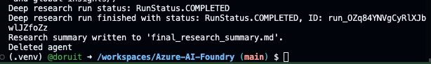
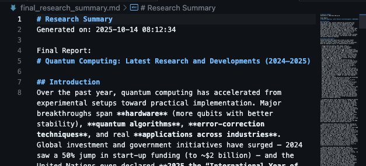

<div align="center">
    
</div>

# Deep Research Introduction
Before diving into the Deep Research tool, it's important to understand its capabilities, prerequisites, and how to effectively utilize it within your Azure AI Foundry projects. 

## Model Details
- **Model Name**: o3-deep-research  
- **Deployment Type**: Global Standard  
- **Available Regions**: West US, Norway East  
- **Quotas and Limits**:  
    - **Enterprise**: 30K RPS / 30M TPM  
    - **Default**: 3K RPS / 3M TPM  

## Research Tool Prerequisites
- If you already have access to the Azure OpenAI o3 model, no request is required to access the o3-deep-research model. Otherwise, fill out the request form.
- An Azure subscription with the ability to create the following resources:  
    - AI Foundry project  
    - Grounding with Bing Search  
    - Deep research model  
    - GPT model resources  
- Set up your environment in the **West US** and **Norway East** regions.
- Grounding with Bing Search tool resource for connecting to your Azure AI Foundry project. 
- Capgemini network limitations: The **Bing Grounding API is blocked on the Capgemini network via Zscaler** (at this moment). To use the Deep Research tool, you will need to connect to a different compute environment that allows access to the Bing Search API. Using Codespaces or another non-Capgemini device is recommended.

> IMPORTANT !!! This means that in order to use the Deep Research tool, you need to have access to the o3-deep-research model and set up the necessary Azure resources in one of the supported regions. As the default region for the workshop is East US, you might need to create a new Azure AI Foundry project in West US or Norway East to use the Deep Research tool. In addition, to make use of the Deep Research tool, the request access form must be filled out if you do not already have access to the o3 model. Please check with your instructor if the model access request has been submitted and approved before proceeding!

## Model Deployments
- **o3-deep-research**:  
    - Version: 2025-06-26  
    - Available Regions: West US, Norway East  
- **gpt-4o**:  
    - Purpose: Intent clarification  
    - Deployment: Same region as the o3-deep-research model  

## Integrated with Grounding with Bing Search
The deep research tool is tightly integrated with Grounding with Bing Search and only supports web-based research. Once the task is scoped, the agent using the Deep Research tool invokes the Grounding with Bing Search tool to gather a curated set of recent web data designed to provide the research model with a foundation of authoritative, high quality, up-to-date sources.

> IMPORTANT !!!
> 
> 1. Your usage of Grounding with Bing Search can incur costs. See the pricing page for details.
> 2. By creating and using a Grounding with Bing Search resource through code-first experience, such as Azure CLI, or deploying through deployment template, you agree to be bound by and comply with the terms available at https://www.microsoft.com/en-us/bing/apis/grounding-legal, which may be updated from time to time.
> 3. When you use Grounding with Bing Search, your customer data is transferred outside of the Azure compliance boundary to the Grounding with Bing Search service. Grounding with Bing Search is not subject to the same data processing terms (including location of processing) and does not have the same compliance standards and certifications as the Azure AI Foundry Agent Service, as described in the Grounding with Bing Search Terms of Use: https://www.microsoft.com/en-us/bing/apis/grounding-legal. It is your responsibility to assess whether use of Grounding with Bing Search in your agent meets your needs and requirements.

# Deployment Steps
## Model Deployment

1. Navigate to the Azure AI Foundry portal: https://portal.azure.com/#view/Microsoft_AiFoundry/AIProjectsMenuBlade/~/Overview and select your project in either West US or Norway East. Copy the project endpoint connection string and project key from the Keys + Endpoint tab.

Save this endpoint to an environment file (.env) as **PROJECT_ENDPOINT**.

1. Navigate to the Models + Endpoints tab.


Deploy the o3-deep-research-model and GPT-4o model. For the o3-deep-research model, select version 2025-06-26 and choose a deployment name. You can leave the other settings as default.


Deploy an Azure OpenAI GPT model that is supported for Deep Research, such as gpt-4o, in the same region as the o3-deep-research model. 

> NOTE !!! 
> Other GPT-series models including GPT-4o-mini and the GPT-4.1 series are not supported for scope clarification in Deep Research.


## Connect Bing Grounding to your project
To use the Deep Research tool, you need to connect a Bing Grounding resource to your Azure AI Foundry project. If you haven't done this yet, follow the instructions in this lab: [Create a Bing Grounding connection](../create-a-bing-grounding-connection/lab-create-a-bing-grounding-connection.md).

# Create an agent with the Deep Research tool
Assuming a new Azure AI Foundry project has been created in either West US or Norway East, follow the steps below to create an agent with the Deep Research tool.


# Install the Azure AI Projects package (pre-release!)
You can install the package with the following command:

```bash
pip install --pre azure-ai-projects
```

## Setup the Python script
Create a new Python script named `deep_research_agent.py` and add the following code:

```python
import os, time
from typing import Optional
from azure.ai.projects import AIProjectClient
from azure.identity import DefaultAzureCredential
from azure.ai.agents import AgentsClient
from azure.ai.agents.models import DeepResearchTool, MessageRole, ThreadMessage
from dotenv import load_dotenv

load_dotenv()  # Load environment variables from .env file

os.environ["AGENT_MODEL_DEPLOYMENT_NAME"] = "gpt-4o" 

def fetch_and_print_new_agent_response(
    thread_id: str,
    agents_client: AgentsClient,
    last_message_id: Optional[str] = None,
) -> Optional[str]:
    response = agents_client.messages.get_last_message_by_role(
        thread_id=thread_id,
        role=MessageRole.AGENT,
    )
    if not response or response.id == last_message_id:
        return last_message_id  # No new content

    print("\nAgent response:")
    print("\n".join(t.text.value for t in response.text_messages))

    for ann in response.url_citation_annotations:
        print(f"URL Citation: [{ann.url_citation.title}]({ann.url_citation.url})")

    return response.id


def create_research_summary(
        message : ThreadMessage,
        filepath: str = "research_summary.md"
) -> None:
    if not message:
        print("No message content provided, cannot create research summary.")
        return

    with open(filepath, "w", encoding="utf-8") as fp:
        # Add timestamp and header
        fp.write(f"# Research Summary\n")
        fp.write(f"Generated on: {time.strftime('%Y-%m-%d %H:%M:%S')}\n\n")
        
        # Write text summary
        text_summary = "\n\n".join([t.text.value.strip() for t in message.text_messages])
        fp.write(text_summary)

        # Write unique URL citations, if present
        if message.url_citation_annotations:
            fp.write("\n\n## References\n")
            seen_urls = set()
            for ann in message.url_citation_annotations:
                url = ann.url_citation.url
                title = ann.url_citation.title or url
                if url not in seen_urls:
                    fp.write(f"- [{title}]({url})\n")
                    seen_urls.add(url)

    print(f"Research summary written to '{filepath}'.")


project_client = AIProjectClient(
    endpoint=os.environ["PROJECT_ENDPOINT"],
    credential=DefaultAzureCredential(),
)

conn_id = project_client.connections.get(name=os.environ["BING_RESOURCE_NAME"]).id


# Initialize a Deep Research tool with Bing Connection ID and Deep Research model deployment name
deep_research_tool = DeepResearchTool(
    bing_grounding_connection_id=conn_id,
    deep_research_model=os.environ["DEEP_RESEARCH_MODEL_DEPLOYMENT_NAME"],
)

# Create Agent with the Deep Research tool and process Agent run
with project_client:

    with project_client.agents as agents_client:

        # Create a new agent that has the Deep Research tool attached.
        # NOTE: To add Deep Research to an existing agent, fetch it with `get_agent(agent_id)` and then,
        # update the agent with the Deep Research tool.
        agent = agents_client.create_agent(
            model=os.environ["AGENT_MODEL_DEPLOYMENT_NAME"],
            name="my-agent",
            instructions="You are a helpful Agent that assists in researching scientific topics.",
            tools=deep_research_tool.definitions,
        )

        # [END create_agent_with_deep_research_tool]
        print(f"Created agent, ID: {agent.id}")

        # Create thread for communication
        thread = agents_client.threads.create()
        print(f"Created thread, ID: {thread.id}")

        # Create message to thread
        message = agents_client.messages.create(
            thread_id=thread.id,
            role="user",
            content=(
                "Give me the latest research into quantum computing over the last year."
            ),
        )
        print(f"Created message, ID: {message.id}")

        print(f"Start processing the initial message... this may take a few minutes to finish. Be patient!")
        # Poll the run as long as run status is queued or in progress
        run = agents_client.runs.create(thread_id=thread.id, agent_id=agent.id)
        last_message_id = None
        while run.status in ("queued", "in_progress"):
            time.sleep(1)
            run = agents_client.runs.get(thread_id=thread.id, run_id=run.id)

            last_message_id = fetch_and_print_new_agent_response(
                thread_id=thread.id,
                agents_client=agents_client,
                last_message_id=last_message_id,
            )
            print(f"Run status: {run.status}")

        print(f"Initial run finished with status: {run.status}, ID: {run.id}")

        if run.status == "failed":
            print(f"Run failed: {run.last_error}")
        else:
            # Get and display the initial response
            initial_message = agents_client.messages.get_last_message_by_role(
                thread_id=thread.id, role=MessageRole.AGENT
            )
            if initial_message:
                print("\n" + "="*60)
                print("INITIAL RESPONSE:")
                print("="*60)
                print("\n".join(t.text.value for t in initial_message.text_messages))
                
                # Show citations if any
                if initial_message.url_citation_annotations:
                    print("\nURL Citations:")
                    for ann in initial_message.url_citation_annotations:
                        print(f"- [{ann.url_citation.title}]({ann.url_citation.url})")
            
            # Ask for user refinement
            print("\n" + "="*60)
            print("You can now provide refinement instructions to improve the research.")
            print("="*60)
            
            refinement = input("\nEnter your refinement instructions (or press Enter to skip): ").strip()
            
            if refinement:
                print(f"\nAdding refinement: {refinement}")
                # Create a new message with the refinement
                refinement_message = agents_client.messages.create(
                    thread_id=thread.id,
                    role="user",
                    content=refinement,
                )
                print(f"Created refinement message, ID: {refinement_message.id}")
                
                print(f"Starting deep research with refinement... this may take several minutes. Be patient!")
                # Create a new run for the refinement
                refined_run = agents_client.runs.create(thread_id=thread.id, agent_id=agent.id)
                last_message_id = None
                
                while refined_run.status in ("queued", "in_progress"):
                    time.sleep(2)  # Slightly longer sleep for deep research
                    refined_run = agents_client.runs.get(thread_id=thread.id, run_id=refined_run.id)

                    last_message_id = fetch_and_print_new_agent_response(
                        thread_id=thread.id,
                        agents_client=agents_client,
                        last_message_id=last_message_id,
                    )
                    print(f"Deep research run status: {refined_run.status}")

                print(f"Deep research run finished with status: {refined_run.status}, ID: {refined_run.id}")
                
                if refined_run.status == "failed":
                    print(f"Refined run failed: {refined_run.last_error}")
            else:
                print("No refinement provided, using initial response.")

        # Fetch the final message from the agent in the thread and create a research summary
        final_message = agents_client.messages.get_last_message_by_role(
            thread_id=thread.id, role=MessageRole.AGENT
        )
        if final_message:
            create_research_summary(final_message, "final_research_summary.md")

        # Clean-up and delete the agent once the run is finished.
        # NOTE: Comment out this line if you plan to reuse the agent later.
        agents_client.delete_agent(agent.id)
        print("Deleted agent")
```

After a while the LLM will respond with an initial response asking for some refinement. You must provide additional instructions to refine the research or just press Enter to skip this step. The agent will then perform deep research and provide a final response.

In our case this was the initial response:

```prompt
@doruit ➜ /workspaces/Azure-AI-Foundry (main) $ /usr/local/bin/python /workspaces/Azure-AI-Foundry/src/workshop/deep-research-tool.py
Created agent, ID: asst_nRFza66mknpm9SrpUNeli3ov
Created thread, ID: thread_Q1OWe66XgIB88Dwio2iEFQuE
Created message, ID: msg_J5P34KmQ8HgKxe5kl4uxNGn3
Start processing the initial message... this may take a few minutes to finish. Be patient!
Run status: RunStatus.IN_PROGRESS

Agent response:
I'll gather the latest research and developments in quantum computing from the past year. This will include breakthroughs, advancements, and notable publications. I will provide this in a structured format for easier understanding, along with credible sources.

Title: Latest Developments in Quantum Computing

 Starting deep research... 

Run status: RunStatus.IN_PROGRESS
Run status: RunStatus.IN_PROGRESS
Run status: RunStatus.IN_PROGRESS
Run status: RunStatus.IN_PROGRESS
Run status: RunStatus.IN_PROGRESS
Run status: RunStatus.IN_PROGRESS
Run status: RunStatus.IN_PROGRESS
Run status: RunStatus.IN_PROGRESS
Run status: RunStatus.IN_PROGRESS
Run status: RunStatus.IN_PROGRESS
Run status: RunStatus.IN_PROGRESS
Run status: RunStatus.IN_PROGRESS
Run status: RunStatus.IN_PROGRESS
Run status: RunStatus.IN_PROGRESS
Run status: RunStatus.IN_PROGRESS
Run status: RunStatus.IN_PROGRESS
Run status: RunStatus.IN_PROGRESS

Agent response:
cot_summary: **Evaluating advanced research**

I'm pulling together the latest quantum computing trends including hardware improvements, novel theories, experimental breakthroughs, and application updates from 2024 to mid-2025. 【1†Bing Search】
```

The research can take several minutes (25 minutes in our case!) to complete so make sure to be patient. Once done, a research summary will be created in the file `final_research_summary.md`. 




# Optional: Use vibe coding to modify the script to output a Word Document
You can use vibe coding to modify the script to output a Word document instead of a markdown file. 

Go to Github Copilot and make sure Agent mode is enabled. In the prompt input section, add the following prompt:

```prompt
Modify the create_research_summary function to output a Word document instead of a markdown file. Use the python-docx library to create the Word document. The document should have a title "Research Summary", a timestamp, the text summary, and a references section with unique URL citations. Save the document as research_summary.docx.
```

While Github Copilot Agent is running it will ask for user input every now and then. Review each Human in the Loop suggestion and accept, reject or answer the questions.

In our case several iterations were needed to get the desired changes. The final version of the script is able to output both a markdown file and a Word documents:

