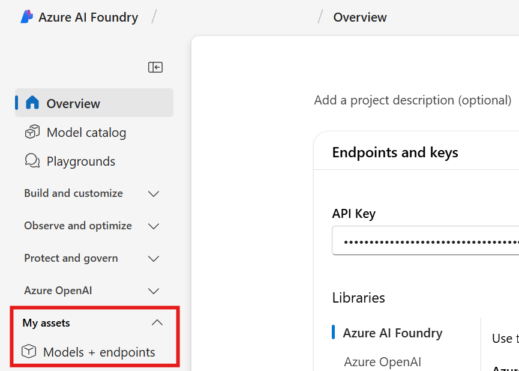
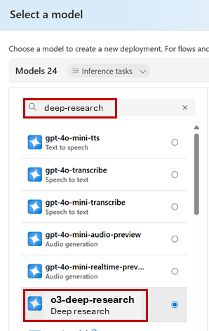
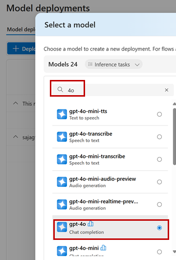
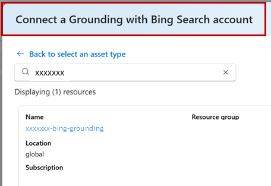
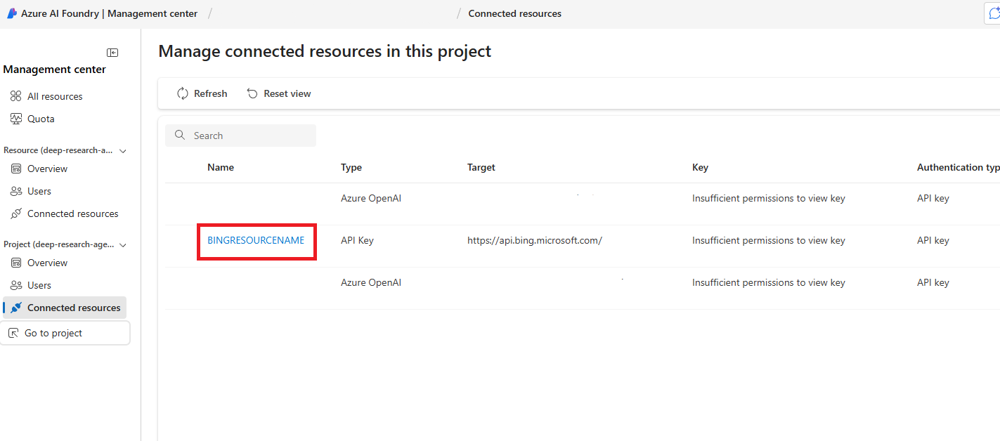

# Deep Research Introduction
Before diving into the Deep Research tool, it's important to understand its capabilities, prerequisites, and how to effectively utilize it within your Azure AI Foundry projects.

## Model Details
- **Model Name**: o3-deep-research  
- **Deployment Type**: Global Standard  
- **Available Regions**: West US, Norway East  
- **Quotas and Limits**:  
    - **Enterprise**: 30K RPS / 30M TPM  
    - **Default**: 3K RPS / 3M TPM  

## Research Tool Prerequisites
- If you already have access to the Azure OpenAI o3 model, no request is required to access the o3-deep-research model. Otherwise, fill out the request form.
- An Azure subscription with the ability to create the following resources:  
    - AI Foundry project  
    - Grounding with Bing Search  
    - Deep research model  
    - GPT model resources  
- Set up your environment in the **West US** and **Norway East** regions.
- Grounding with Bing Search tool resource for connecting to your Azure AI Foundry project.

> IMPORTANT !!! This means that in order to use the Deep Research tool, you need to have access to the o3-deep-research model and set up the necessary Azure resources in one of the supported regions. As the default region for the workshop is East US, you might need to create a new Azure AI Foundry project in West US or Norway East to use the Deep Research tool.

## Model Deployments
- **o3-deep-research**:  
    - Version: 2025-06-26  
    - Available Regions: West US, Norway East  
- **gpt-4o**:  
    - Purpose: Intent clarification  
    - Deployment: Same region as the o3-deep-research model  

## Integrated with Grounding with Bing Search
The deep research tool is tightly integrated with Grounding with Bing Search and only supports web-based research. Once the task is scoped, the agent using the Deep Research tool invokes the Grounding with Bing Search tool to gather a curated set of recent web data designed to provide the research model with a foundation of authoritative, high quality, up-to-date sources.

> IMPORTANT !!!
> 
> 1. Your usage of Grounding with Bing Search can incur costs. See the pricing page for details.
> 2. By creating and using a Grounding with Bing Search resource through code-first experience, such as Azure CLI, or deploying through deployment template, you agree to be bound by and comply with the terms available at https://www.microsoft.com/en-us/bing/apis/grounding-legal, which may be updated from time to time.
> 3. When you use Grounding with Bing Search, your customer data is transferred outside of the Azure compliance boundary to the Grounding with Bing Search service. Grounding with Bing Search is not subject to the same data processing terms (including location of processing) and does not have the same compliance standards and certifications as the Azure AI Foundry Agent Service, as described in the Grounding with Bing Search Terms of Use: https://www.microsoft.com/en-us/bing/apis/grounding-legal. It is your responsibility to assess whether use of Grounding with Bing Search in your agent meets your needs and requirements.

# Deployment Steps
## Model Deployment

1. Navigate to the Azure AI Foundry portal: https://portal.azure.com/#view/Microsoft_AiFoundry/AIProjectsMenuBlade/~/Overview and select your project in either West US or Norway East. Copy the project endpoint connection string and project key from the Keys + Endpoint tab.

Save this endpoint to an environment file (.env) as **PROJECT_ENDPOINT**.

1. Navigate to the Models + Endpoints tab.



Deploy the o3-deep-research-model and GPT-4o model.



Deploy an Azure OpenAI GPT model that is supported for Deep Research, such as gpt-4o, in the same region as the o3-deep-research model. 

> NOTE !!! 
> Other GPT-series models including GPT-4o-mini and the GPT-4.1 series are not supported for scope clarification in Deep Research.



Save the name of your o3-deep-research deployment and gpt-4o deployment to your environment file as **DEEP_RESEARCH_MODEL_DEPLOYMENT_NAME** and **MODEL_DEPLOYMENT_NAME** respectively.

Connect a Grounding with Bing Search account.



The name of your Grounding with Bing Search resource name. You can find it in the Azure AI Foundry portal by selecting Management center from the left navigation menu. Then select Connected resources.



Save the name of your Grounding with Bing Search resource to your environment file as **BING_RESOURCE_NAME**.

# Create an agent with the Deep Research tool
Assuming a new Azure AI Foundry project has been created in either West US or Norway East, follow the steps below to create an agent with the Deep Research tool.

The Deep Research tool requires the latest prerelease versions of the azure-ai-projects library. First we recommend creating a virtual environment to work in:

Console

```python
python -m venv env
# after creating the virtual environment, activate it with:
.\env\Scripts\activate
```
You can install the package with the following command:

```python
pip install --pre azure-ai-projects
```

Create an environment file to store your environment variables. Create a file named `.env` in the root of your project directory and add the following content, replacing the placeholder values with your actual configuration details:

```python
# Azure AI Foundry Project Configuration
PROJECT_ENDPOINT="<your project endpoint>"
MODEL_DEPLOYMENT_NAME="<your gpt-4o model deployment name>"
DEEP_RESEARCH_MODEL_DEPLOYMENT_NAME="<your deep research model deployment name>"
BING_RESOURCE_NAME="<your grounding with bing search resource name>"
``` 

Create a new file named `create_deep_research_agent.py` and add the following code:

```python
import os, time
from typing import Optional
from azure.ai.projects import AIProjectClient
from azure.identity import DefaultAzureCredential
from azure.ai.agents import AgentsClient
from azure.ai.agents.models import DeepResearchTool, MessageRole, ThreadMessage


def fetch_and_print_new_agent_response(
    thread_id: str,
    agents_client: AgentsClient,
    last_message_id: Optional[str] = None,
) -> Optional[str]:
    response = agents_client.messages.get_last_message_by_role(
        thread_id=thread_id,
        role=MessageRole.AGENT,
    )
    if not response or response.id == last_message_id:
        return last_message_id  # No new content

    print("\nAgent response:")
    print("\n".join(t.text.value for t in response.text_messages))

    for ann in response.url_citation_annotations:
        print(f"URL Citation: [{ann.url_citation.title}]({ann.url_citation.url})")

    return response.id


def create_research_summary(
        message : ThreadMessage,
        filepath: str = "research_summary.md"
) -> None:
    if not message:
        print("No message content provided, cannot create research summary.")
        return

    with open(filepath, "w", encoding="utf-8") as fp:
        # Write text summary
        text_summary = "\n\n".join([t.text.value.strip() for t in message.text_messages])
        fp.write(text_summary)

        # Write unique URL citations, if present
        if message.url_citation_annotations:
            fp.write("\n\n## References\n")
            seen_urls = set()
            for ann in message.url_citation_annotations:
                url = ann.url_citation.url
                title = ann.url_citation.title or url
                if url not in seen_urls:
                    fp.write(f"- [{title}]({url})\n")
                    seen_urls.add(url)

    print(f"Research summary written to '{filepath}'.")


project_client = AIProjectClient(
    endpoint=os.environ["PROJECT_ENDPOINT"],
    credential=DefaultAzureCredential(),
)

conn_id = project_client.connections.get(name=os.environ["BING_RESOURCE_NAME"]).id


# Initialize a Deep Research tool with Bing Connection ID and Deep Research model deployment name
deep_research_tool = DeepResearchTool(
    bing_grounding_connection_id=conn_id,
    deep_research_model=os.environ["DEEP_RESEARCH_MODEL_DEPLOYMENT_NAME"],
)

# Create Agent with the Deep Research tool and process Agent run
with project_client:

    with project_client.agents as agents_client:

        # Create a new agent that has the Deep Research tool attached.
        # NOTE: To add Deep Research to an existing agent, fetch it with `get_agent(agent_id)` and then,
        # update the agent with the Deep Research tool.
        agent = agents_client.create_agent(
            model=os.environ["MODEL_DEPLOYMENT_NAME"],
            name="my-agent",
            instructions="You are a helpful Agent that assists in researching scientific topics.",
            tools=deep_research_tool.definitions,
        )

        # [END create_agent_with_deep_research_tool]
        print(f"Created agent, ID: {agent.id}")

        # Create thread for communication
        thread = agents_client.threads.create()
        print(f"Created thread, ID: {thread.id}")

        # Create message to thread
        message = agents_client.messages.create(
            thread_id=thread.id,
            role="user",
            content=(
                "Give me the latest research into quantum computing over the last year."
            ),
        )
        print(f"Created message, ID: {message.id}")

        print(f"Start processing the message... this may take a few minutes to finish. Be patient!")
        # Poll the run as long as run status is queued or in progress
        run = agents_client.runs.create(thread_id=thread.id, agent_id=agent.id)
        last_message_id = None
        while run.status in ("queued", "in_progress"):
            time.sleep(1)
            run = agents_client.runs.get(thread_id=thread.id, run_id=run.id)

            last_message_id = fetch_and_print_new_agent_response(
                thread_id=thread.id,
                agents_client=agents_client,
                last_message_id=last_message_id,
            )
            print(f"Run status: {run.status}")

        print(f"Run finished with status: {run.status}, ID: {run.id}")

        if run.status == "failed":
            print(f"Run failed: {run.last_error}")

        # Fetch the final message from the agent in the thread and create a research summary
        final_message = agents_client.messages.get_last_message_by_role(
            thread_id=thread.id, role=MessageRole.AGENT
        )
        if final_message:
            create_research_summary(final_message)

        # Clean-up and delete the agent once the run is finished.
        # NOTE: Comment out this line if you plan to reuse the agent later.
        agents_client.delete_agent(agent.id)
        print("Deleted agent")
```

Run the script from your terminal:

```python
python create_deep_research_agent.py
```
