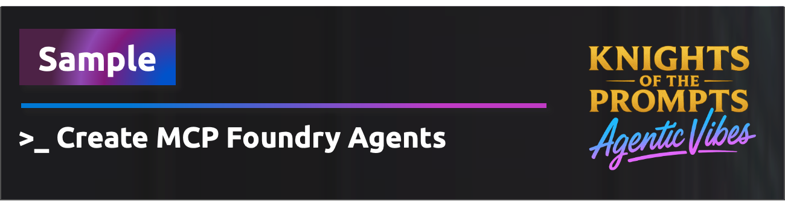

<div align="center">
   
</div>

# AI Foundry Agent Connected to MCP Server

A simple web application that allows you to chat with Azure AI Foundry Agents that are connected to remote MCP (Model Context Protocol) servers.

## Important Requirements

⚠️ **MCP Server Requirements**: This application only works with:
- **Remote MCP servers** that are publicly accessible via HTTP/HTTPS
- **No authentication required** - servers that don't require API keys, tokens, or authentication
- **Proper CORS configuration** to allow browser connections from Azure App Service

Common examples that work:
- Public demo MCP servers
- Local MCP servers exposed via ngrok or similar tunneling services
- Custom MCP servers deployed without authentication requirements

📚 **For more information about MCP servers and App Service samples, see**: [Integrate AI into your Azure App Service applications](https://learn.microsoft.com/azure/app-service/overview-ai-integration#model-context-protocol-mcp-servers)

## Architecture

```
┌─────────────────┐    ┌──────────────────┐    ┌─────────────────┐
│   Web Interface │────│   FastAPI App    │────│ Remote MCP      │
│   (Single Page) │    │   + Azure AI     │    │ Server          │
│                 │    │   Foundry        │    │ (Public/No Auth)│
└─────────────────┘    └──────────────────┘    └─────────────────┘
                                │
                       ┌──────────────────┐
                       │   Azure AI       │
                       │   Foundry +      │
                       │   GPT-4o         │
                       └──────────────────┘
```

## Quick Start

### Prerequisites

- Python 3.11+
- Azure subscription (for AI features)
- Azure Developer CLI (azd)

### Local Development

⚠️ **Important**: Local development requires Azure AI Foundry resources to be already deployed and environment variables configured. For the easiest setup, deploy directly to Azure using the instructions below.

1. **Clone and setup:**
   ```bash
   git clone <your-repo-url>
   cd python-mcp-agent-chat
   python -m venv .venv
   .venv\Scripts\activate  # Windows (.venv/bin/activate on Linux/Mac)
   pip install -r requirements.txt
   ```

2. **Configure environment variables (optional - only needed for local development if you want to run the app locally):**
   Create a `.env` file or set these environment variables:
   ```
   AZURE_AI_PROJECT_ENDPOINT=https://your-ai-project.westus.ai.azure.com/api/projects/your-project
   AZURE_AI_PROJECT_NAME=your-project-name
   MODEL_DEPLOYMENT=gpt-4o
   ```
   > These values are available in your Azure AI Foundry project after deployment

3. **Set up Azure credentials:**
   ```bash
   az login
   ```
   Ensure you're logged into the same Azure account that has access to your AI Foundry resources.

4. **Run locally:**
   ```bash
   python main.py
   ```
   Visit http://localhost:8000 to access the application.

**💡 Recommended**: Deploy to Azure first using `azd up` below, then optionally set up local development afterward.

### Azure Deployment

Login to the Azure Developer CLI (azd):

```bash
azd auth login
```

Deploy using Azure Developer CLI (azd):

```bash
azd up
```

This will:
- Deploy the FastAPI application to Azure App Service
- Set up Azure AI Foundry integration  
- Configure managed identity for secure authentication

The deployed application will be accessible at the URL provided after deployment.

## How It Works

The application provides a simple interface to:

1. **Connect to MCP Servers**: Enter the URL of a remote MCP server  
2. **Chat with AI Agent**: The AI agent can use tools from the connected MCP server
3. **Rich Responses**: AI responses are formatted with markdown support and syntax highlighting

### Example Usage

1. Visit the application homepage
2. Enter a remote MCP server URL (e.g., `https://your-mcp-server.com/mcp`)
3. Start chatting with the AI agent
4. The agent can use tools from the MCP server to help answer your questions