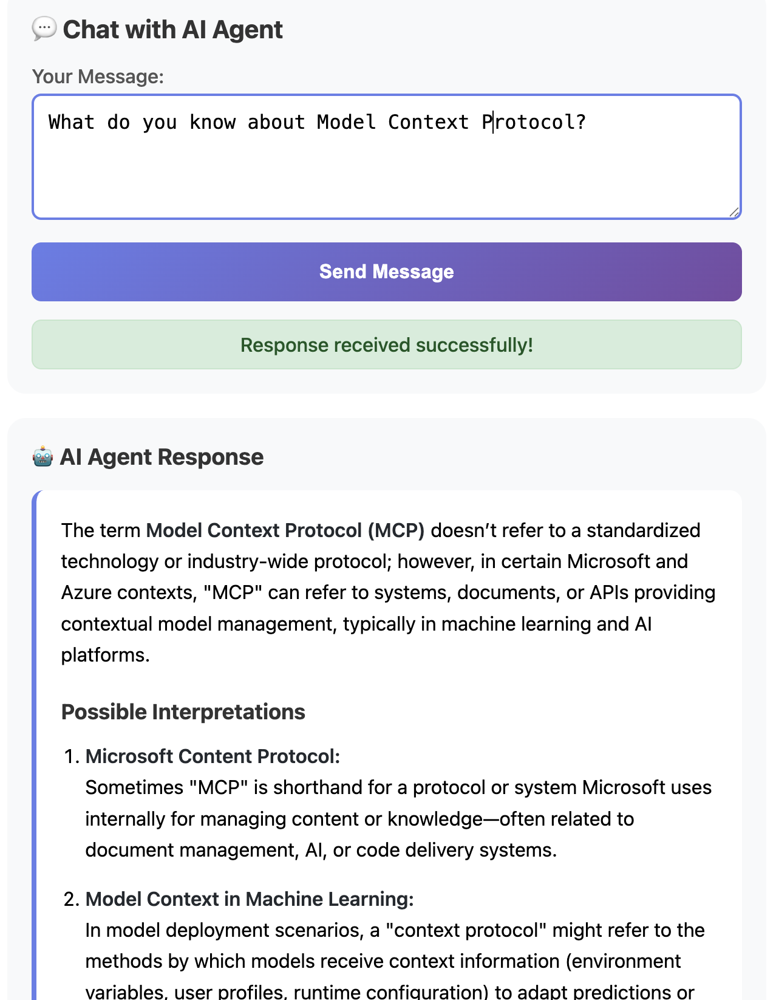
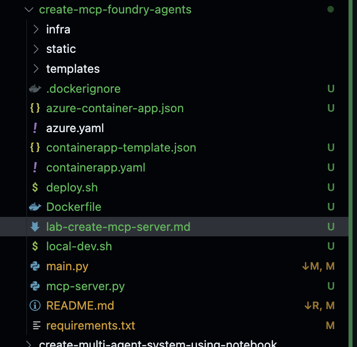
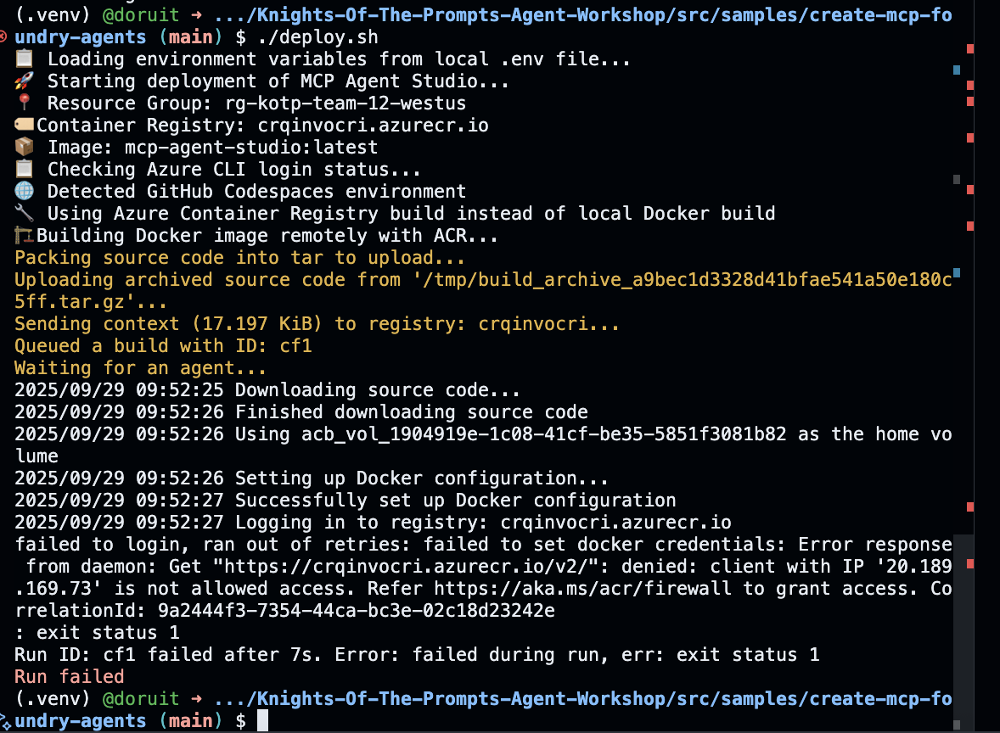
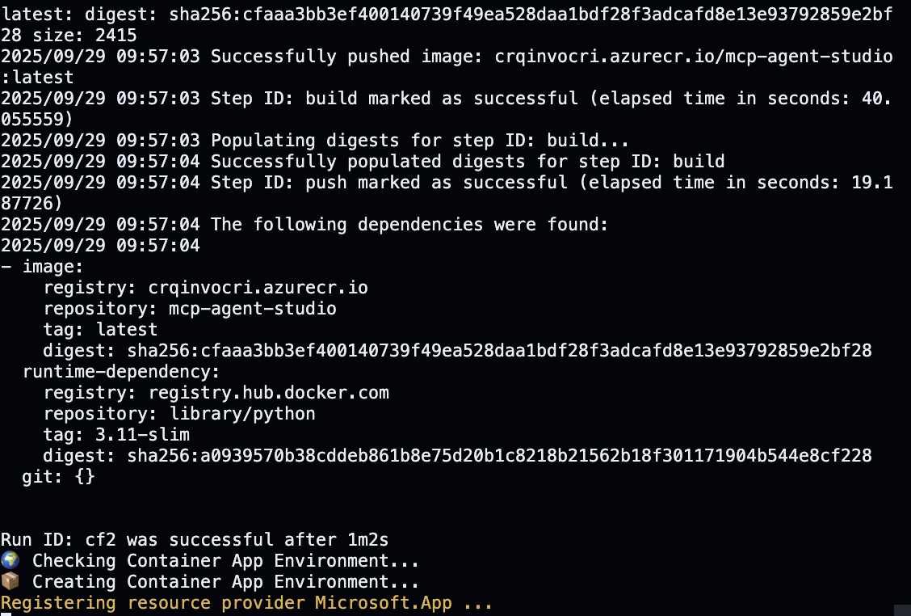
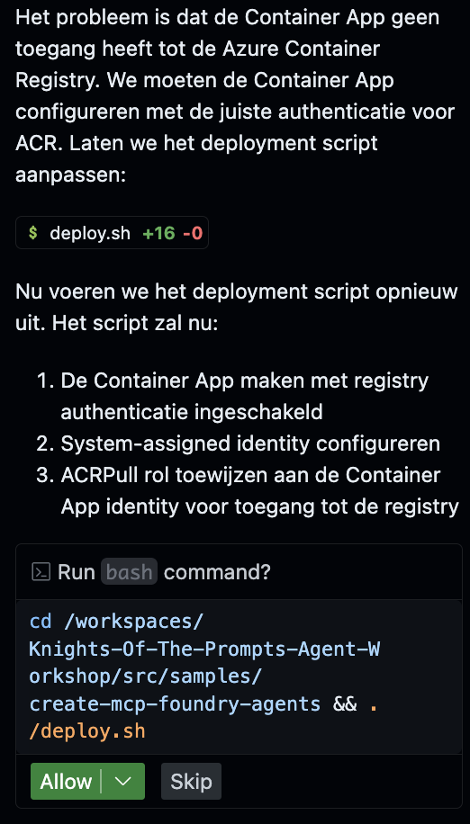

<div align="center">
   
</div>

# AI Foundry Agent Connected to MCP Server

A simple web application that allows you to chat with Azure AI Foundry Agents that are connected to remote MCP (Model Context Protocol) servers.

## Important Requirements

⚠️ **MCP Server Requirements**: This application only works with:
- **Remote MCP servers** that are publicly accessible via HTTP/HTTPS
- **No authentication required** - servers that don't require API keys, tokens, or authentication
- **Proper CORS configuration** to allow browser connections from Azure App Service

Common examples that work:
- Public demo MCP servers
- Local MCP servers exposed via ngrok or similar tunneling services
- Custom MCP servers deployed without authentication requirements

📚 **For more information about MCP servers and App Service samples, see**: [Integrate AI into your Azure App Service applications](https://learn.microsoft.com/azure/app-service/overview-ai-integration#model-context-protocol-mcp-servers)

## Architecture

```
┌─────────────────┐    ┌──────────────────┐    ┌─────────────────┐
│   Web Interface │────│   FastAPI App    │────│ Remote MCP      │
│   (Single Page) │    │   + Azure AI     │    │ Server          │
│                 │    │   Foundry        │    │ (Public/No Auth)│
└─────────────────┘    └──────────────────┘    └─────────────────┘
                                │
                       ┌──────────────────┐
                       │   Azure AI       │
                       │   Foundry +      │
                       │   GPT-4o         │
                       └──────────────────┘
```

## Quick Start

### Prerequisites

- Python 3.11+
- Azure subscription (for AI features)
- Azure Developer CLI (azd)

### Local Development

⚠️ **Important**: Local development requires Azure AI Foundry resources to be already deployed and environment variables configured. For the easiest setup, deploy directly to Azure using the instructions below.

1. **Configure environment variables (optional - only needed for local development if you want to run the app locally):**
   Create a `.env` file or set these environment variables:
   ```
   AZURE_AI_PROJECT_ENDPOINT=https://your-ai-project.westus.ai.azure.com/api/projects/your-project
   AZURE_AI_PROJECT_NAME=your-project-name
   MODEL_DEPLOYMENT=gpt-4o
   ```
   > These values are available in your Azure AI Foundry project after deployment

2. **Set up Azure credentials:**
   ```bash
   az login --use-device-code
   ```
   Ensure you're logged into the same Azure account that has access to your AI Foundry resources.

3. **Run locally:**
   ```bash
   python main.py
   ```
   Visit http://localhost:8000 to access the application.

You should see a simple interface to connect to a remote MCP server and chat with the AI agent:


## Using the MCP Agent Application

The application provides a simple interface to:

1. **Connect to MCP Servers**: Enter the URL of a remote MCP server, for instance: https://learn.microsoft.com/ai/mcp
2. **Chat with AI Agent**: The AI agent can use tools from the connected MCP server, you can ask questions like:
   - "What do you know about Model Context Protocol?"
   - "What categories of knowledge do you have?"
3. **Rich Responses**: AI responses are formatted with markdown support and syntax highlighting

See the screenshot below for an example interaction:



## Optional: Deploy to Azure (not tested)
Login to the Azure Developer CLI (azd):

azd auth login
Deploy using Azure Developer CLI (azd):

azd up
This will:

- Deploy the FastAPI application to Azure App Service
- Set up Azure AI Foundry integration
- Configure managed identity for secure authentication
- The deployed application will be accessible at the URL provided after deployment.

## Optional (2): Use Github Copilot Agent mode to deploy the app to Azure

Using Github Copilot Agent mode, you can deploy this app to Azure Container Apps using Flask. Make sure to point to the pre-deployed Azure Container Registry: <your ACR resource name>.azurecr.io

```prompt
i want to deploy this app to azure container apps using flask. make sure to use this registry: <your ACR resource name>.azurecr.io
```

In our example it created dockerfile, changed the Python code to use Flask, created a requirements.txt file, and created the necessary deployment templates and files to deploy to Azure Container Apps. See the screenshot below:



You might need to iterate a few times to get everything right, but in the end you should be able to deploy the app to Azure Container Apps. In our case we had to add the IP address to the Firewall whitelist of the Azure Container Registry:



After that the deployment got further:



At the Container App deployment we ran into another error:


This was due to the fact the Azure Container Apps needs permissions on the Azure Container Registry. We used Github Copilot Agent mode to fix this: 



After the deployment of the Azure Container App resources we were able to access the app in the browser:

#TODO: finish this section
