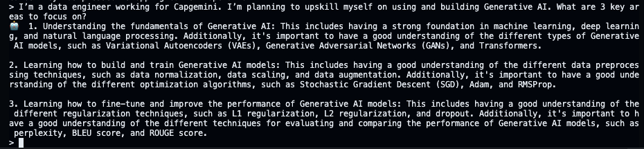

# Get Started with Foundry Local
## Description
In this Lab, you’ll learn how to get started with Foundry Local and setting up AI models locally. 

### Prerequisites
Your system must meet the following requirements to run Foundry Local:

- Operating System: Windows 10 (x64), Windows 11 (x64/ARM), Windows Server 2025, macOS.
- Hardware: Minimum 8GB RAM, 3GB free disk space. Recommended 16GB RAM, 15GB free disk space.
- Network: Internet connection for initial model download (optional for offline use)
- Acceleration (optional): NVIDIA GPU (2,000 series or newer), AMD GPU (6,000 series or newer), Intel iGPU, Qualcomm Snapdragon X Elite (8GB or more of memory), or Apple silicon.
- Also, ensure you have administrative privileges to install software on your device.

On your local machine, run the following commands to set up Foundry Local (including brew if not already installed):

```bash
/bin/bash -c "$(curl -fsSL https://raw.githubusercontent.com/Homebrew/install/HEAD/install.sh)"
echo >> /home/vscode/.bashrc
echo 'eval "$(/home/linuxbrew/.linuxbrew/bin/brew shellenv)"' >> /home/vscode/.bashrc
eval "$(/home/linuxbrew/.linuxbrew/bin/brew shellenv)"
brew tap microsoft/foundrylocal
brew install foundrylocal
```

To verify the installation, run:

```bash
foundry --version
```
You should see the version of Foundry Local printed in the terminal.

To list all available models, run:

```bash
foundry model list
```
You should see a list of available models, including "phi-3-mini", "gpt-4o-mini", and others:


Next, you can run your first model. Make sure you will choose a model that can run on your hardware. For example, if you have a CPU-only machine, you can use the "mistral-7b-v0.2" model. If you want to use a smaller lighter model, you can use "phi-4-mini".

Run the model by running the following command:

```bash
foundry model run mistral-7b-v0.2
```

The model downloads - this may take a few minutes. Once the model is downloaded, you can interact with it by typing in the terminal. For example, you can ask it to tell you a joke:

```plaintext
I’m a data engineer working for Capgemini. I’m planning to upskill myself on using and building Generative AI. What are 3 key areas to focus on? 
```

You should see the model response in the terminal:



Well done! You have successfully set up Foundry Local and run your first AI model locally. You can now explore more models and experiment with different prompts. Sovereign AI is now at your fingertips!