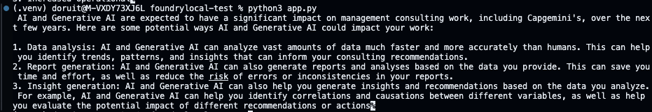
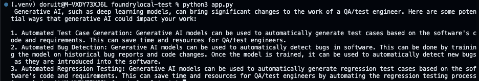

Before you begin, ensure you have completed the steps in the [Get Started with Foundry Local](lab-get-started-with-foundry-local.md) guide.

## Introduction
Using Foundry Local + the OpenAI SDK combines local sovereignty/performance with a mature, widely adopted developer interface.

Key benefits:

- **Single API surface**: Same chat/completions interface works locally and (later) against Azure or OpenAI-hosted models with minimal changes (just base_url + key).
- **Faster iteration**: Local model startup + no network latency speeds prompt and agent loop tuning.
- **Privacy & sovereignty**: Data stays on the machine for sensitive prototyping; no accidental external calls.
- **Seamless fallback**: Easy to implement: try local first, fallback to a remote (Azure) deployment when the task exceeds local capability.
- **Ecosystem compatibility**: Works with existing OpenAI SDK middleware (logging, retry, tracing wrappers).
- **Feature parity path**: When local adds support for features (streaming, function/tool calling), existing SDK patterns transfer directly.
- **Model abstraction**: Use aliases (e.g., phi-3.5-mini) while deferring exact model selection/updates to Foundry Local.
- **Cost control**: Free/local experimentation before moving higher-quality or larger context workloads to cloud models.
- **Offline resilience**: Enables partially disconnected agent workflows.
- **Testing & CI**: Deterministic/local test harnesses without burning cloud quota.
- **Progressive enhancement**: Start local → selectively route queries (e.g., long context, higher reasoning) to cloud.

## Prerequisites
Install the following python packages if you haven't already:

```bash
pip install openai
pip install foundry-local-sdk
pip install requests
```

> TIP: If you are using a virtual environment, make sure to activate it before installing the packages! Use venv as conda library is blocked on some corporate machines. (command to use venv: `python -m venv .venv` and then `source .venv/bin/activate` on Mac/Linux or `.venv\Scripts\activate` on Windows)

## Use OpenAI SDK with Foundry Local

The following example demonstrates how to use the OpenAI SDK with Foundry Local. The code initializes the Foundry Local service, loads a model, and generates a response using the OpenAI SDK.

Copy-and-paste the following code into a Python file named app.py:

```python
import openai
from foundry_local import FoundryLocalManager

# By using an alias, the most suitable model will be downloaded 
# to your end-user's device. 
# alias = "phi-3.5-mini"
alias = "mistral-7b-v0.2"

# Create a FoundryLocalManager instance. This will start the Foundry
# Local service if it is not already running and load the specified model.
manager = FoundryLocalManager(alias)
# The remaining code uses the OpenAI Python SDK to interact with the local model.
# Configure the client to use the local Foundry service
client = openai.OpenAI(
    base_url=manager.endpoint,
    api_key=manager.api_key  # API key is not required for local usage
)
# Set the model to use and generate a response
response = client.chat.completions.create(
    model=manager.get_model_info(alias).id,
    messages=[{"role": "user", "content": "I'm a business analyst working for Capgemini. I'm planning to upskill myself in AI and GenAI. Can you explain how my work will change over de next few years?"}]
)
print(response.choices[0].message.content)
```

Run the script using the command:

```bash
python3 app.py
```

> NOTE: Depending on the model you selected, it may take a few minutes to download the model the first time you run the script. Subsequent runs will be much faster. Make sure that the model you choose is downloaded completely before running the script to avoid long wait times.

You should see a response generated by the local model:


## Add a streaming response
If you want to see the response as it is being generated, you can enable streaming as follows:

```python
import openai
from foundry_local import FoundryLocalManager

# By using an alias, the most suitable model will be downloaded 
# to your end-user's device.
alias = "mistral-7b-v0.2"

# Create a FoundryLocalManager instance. This will start the Foundry 
# Local service if it is not already running and load the specified model.
manager = FoundryLocalManager(alias)

# The remaining code us es the OpenAI Python SDK to interact with the local model.

# Configure the client to use the local Foundry service
client = openai.OpenAI(
    base_url=manager.endpoint,
    api_key=manager.api_key  # API key is not required for local usage
)

# Set the model to use and generate a streaming response
stream = client.chat.completions.create(
    model=manager.get_model_info(alias).id,
    messages=[{"role": "user", "content": "I’m a management consultant working for Capgemini and i want to know how AI and Generative AI will impact my work over the next few years?"}],
    stream=True
)

# Print the streaming response
for chunk in stream:
    if chunk.choices[0].delta.content is not None:
        print(chunk.choices[0].delta.content, end="", flush=True)

```
Run the script using the command:

```bash
python3 app.py
```

The response will be printed as it is being generated:


## Use requests with Foundry Local

### Requests library overview

The Python **requests** package is a high-level HTTP client that simplifies making web requests.

Core value:
- Provides simple functions (get, post, put, delete) instead of manual socket or urllib handling
- Automatic handling of JSON (request/response .json()), redirects, cookies, sessions
- Easy custom headers, query params, timeouts, retries (with adapters), streaming responses
- Clear access to raw status codes, headers, and body for debugging
- Supports file upload/download and chunked/streamed responses
- Extensible via Session objects for connection pooling and auth
- More readable and concise than urllib for REST/JSON APIs

In this lab context, it lets you hit the local Foundry /chat/completions endpoint directly to:
- Inspect exact payloads
- Prototype before an SDK feature exists
- Build minimal dependencies for constrained environments

### Code Example
Replace the code in app.py with the following code to use the requests library to interact with Foundry Local:

```python
# Install with: pip install requests
import requests
import json
from foundry_local import FoundryLocalManager

# By using an alias, the most suitable model will be downloaded 
# to your end-user's device. 
alias = "mistral-7b-v0.2"

# Create a FoundryLocalManager instance. This will start the Foundry
# Local service if it is not already running and load the specified model.
manager = FoundryLocalManager(alias)

url = manager.endpoint + "/chat/completions"

payload = {
    "model": manager.get_model_info(alias).id,
    "messages": [
        {"role": "user", "content": "I’m a QA/test engineer working for Capgemini. How will Generative AI change my work?"}
    ]
}

headers = {
    "Content-Type": "application/json"
}

response = requests.post(url, headers=headers, data=json.dumps(payload))
print(response.json()["choices"][0]["message"]["content"])
```

Run the script using the command:

```bash
python3 app.py
```
You should see a response generated by the local model:


